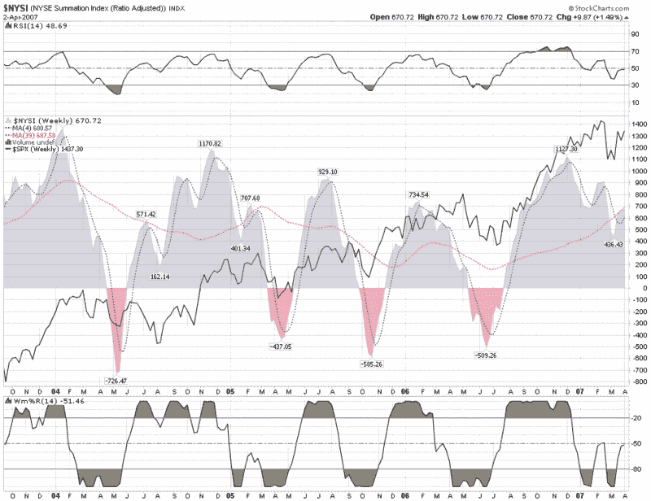

<!--yml
category: 未分类
date: 2024-05-18 15:51:09
-->

# VIX and More: The McClellan Summation Index

> 来源：[http://vixandmore.blogspot.com/2007/04/mcclellan-summation-index.html#0001-01-01](http://vixandmore.blogspot.com/2007/04/mcclellan-summation-index.html#0001-01-01)

The McClellan Summation Index is named after its originators, [Sherman and Marion McClellan](http://www.mcoscillator.com/about.html), who developed this indicator in 1969\. This index and its counterpart, the McClellan Oscillator, are tools for evaluating trends in market breadth (advancing issues minus declining issues) and should be in every investor’s toolbox.

The Summation Index and the Oscillator are derived from the same set of calculations, with the Oscillator data presented in a manner better suited to short and intermediate term trading and the Summation Index targeted at identifying changes in the longer term trend. For a more detailed discussion of the specific calculations involved, see

[DecisionPoint](http://www.decisionpoint.com/TAcourse/AboutMcOsi.html)

or

[Stockcharts.com](http://stockcharts.com/school/doku.php?id=chart_school:technical_indicators:introduction_to_mark#mcclellan_summation_)

.

With this indicator, I prefer to take a longer term view of the markets and therefore have included below a weekly chart of the McClellan Summation Index (also generically know as the NYSE Summation Index) going back to 2003\. A glance at the chart shows that in the rally from the 2002 lows, the Summation Index has done an excellent job of calling both highs and lows in advance of market turns, with a 2-3 month warning for market highs and a much tighter warning period for lows. Also note that these highs and lows have tended to fall into a pattern of 7-12 month cycles over the past few years.

My thinking is that when an indicator is working, stay with it, especially if it is doing a good job of calling market turns.

As for the current Summation Index readings and what it augurs for the markets in the second quarter and beyond, the fact that the Summation Index is sitting right at the 39 week SMA tells me that we are more likely to be range-bound at least in the short term than moving sharply higher or lower.

Remember, we all stand on the shoulders of giants; it pays to know a little about these giants.

 *[source:  StockCharts.com]*