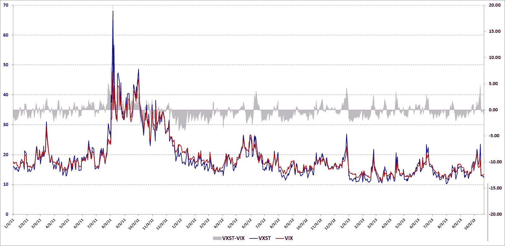

<!--yml
category: 未分类
date: 2024-05-18 16:12:42
-->

# VIX and More: The New VXST and the VXST:VIX Ratio

> 来源：[http://vixandmore.blogspot.com/2013/10/the-new-vxst-and-vxstvix-ratio.html#0001-01-01](http://vixandmore.blogspot.com/2013/10/the-new-vxst-and-vxstvix-ratio.html#0001-01-01)

At the beginning of the month several interesting announcements came out of the CBOE Risk Management Conference in Portugal. One which particularly caught my interest was the [announcement](http://ir.cboe.com/releasedetail.cfm?ReleaseID=794060) of the launch of the new CBOE Short-Term Volatility Index ([VXST](http://vixandmore.blogspot.com/search/label/VXST)), which is essentially identical to the VIX, except that whereas the VIX is looking ahead at a window of 30 calendar days, the VXST measures [implied volatility](http://en.wikipedia.org/wiki/Implied_volatility) of options on the [S&P 500 index](http://www2.standardandpoors.com/portal/site/sp/en/us/page.topic/indices_500/2,3,2,2,0,0,0,0,0,0,0,0,0,0,0,0.html) (SPX) for the next 9 calendar days.

This means that the CBOE now has three different indices to measure implied volatility expectations in SPX options:

*   9 days (VXST)
*   30 days (VIX)
*   93 days ([VXV](http://vixandmore.blogspot.com/search/label/VXV))

The VXV has been a favorite subject of mine going back to my initial comments on the index and the [VIX:VXV ratio](http://vixandmore.blogspot.com/search/label/VIX%3AVXV) I pioneered as an indicator back in December 2007\. With the new VXST, investors now have a better gauge of volatility expectations to apply to time frames that are appropriate for [weekly options](http://vixandmore.blogspot.com/search/label/weeklys), which are on track to account for about 25% of all options trades by the end of the year.

The launch of VXST options opens up a whole new set of possibilities, not the least of which is a [VXST:VIX ratio](http://vixandmore.blogspot.com/search/label/VXST%3AVIX) that offers some possibilities as an indicator that are similar to those of the VIX:VXV ratio. In the chart below, I have mapped not the ratio of VXST:VIX, but the differential between the two indices. With VXST historical data going back to the beginning of 2011, it is worth noting that the VIX has been higher than VXST about 61% of the time. Typically, when volatility spikes, VXST spikes much higher than the VIX, with the bulk of the 39% of the instances in which VXST is higher than VIX occurring mostly during periods of elevated volatility.

*[source(s): CBOE, VIX and More]*

I will go into much greater detail regarding VXST:VIX vs. VIX:VXV at a later point. For now it is worth noting that these ratios have some advantage to comparing the [VIX futures](http://vixandmore.blogspot.com/search/label/VIX%20futures) [term structure](http://vixandmore.blogspot.com/search/label/term%20structure) in that the indices focus on a fixed time period, while the days to expiration of the VIX futures is constantly in flux.

Also of interest, the CBOE press release notes:

> *“Plans call for CBOE and CBOE Futures Exchange, LLC (CFE®) to introduce VXST Weeklys options and futures. The launch dates for these tradable VXST products are yet to be determined, pending regulatory approval.”*

As compelling as VIX products are for trading, I can imagine that VXST options and futures might be even more attractive to certain types of traders. Also, if VXST futures gain some traction, I can envision ETPs based on these that might rival the interest in VXX at some point.

In other words, this could easily turn out to be a huge development in the volatility space.

Related posts:

***Disclosure(s):*** *short VXX at time of writing;theCBOE is an advertiser on VIX and More*