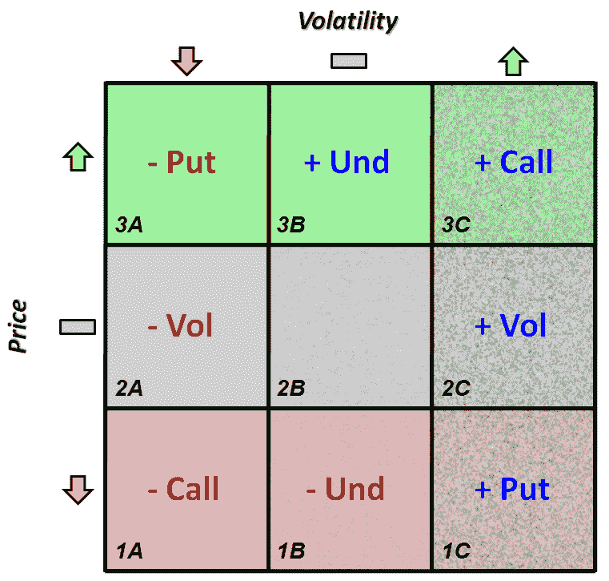

<!--yml
category: 未分类
date: 2024-05-18 17:53:19
-->

# VIX and More: The Options Opportunity Matrix

> 来源：[http://vixandmore.blogspot.com/2009/04/options-opportunity-matrix.html#0001-01-01](http://vixandmore.blogspot.com/2009/04/options-opportunity-matrix.html#0001-01-01)

Maybe I spent too much of my former life in consulting, where [2x2 matrices](http://www.amazon.com/Power-Matrix-Thinking-Decisions-Management/dp/0787972924/ref=cm_cr_pr_product_top) seem to grow wild on PowerPoint slides, but I have always found that a matrix is a useful way to help compare and contrast the tension between conflicting yet sometimes complementary ideas.

I mention this because I have recently fielded several questions about my options trading approach. In thinking about how I might want to discuss the subject, I realized that I have unknowingly been carrying around a 3x3 options matrix in my head for the past few years. Since I have yet to encounter anything like it, I thought this might be a good time to give the matrix a name and use it as a prop to discuss options strategies.

The graphic below, which I am calling the [Options Opportunity Matrix](http://vixandmore.blogspot.com/search/label/Options%20Opportunity%20Matrix), lays out a portion of my approach.

Let me take a minute to explain the graphic a little. When most investors consider whether or not to invest in a stock, they have an opinion about the future price of the stock. Their price forecast is represented by the Y-axis and is color coded for easy reference. The upper most row is green (3A-3C) to reflect an anticipated price appreciation; the lower row is red (1A-1C) to indicate a bearish price forecast; and the middle row is shaded gray (2A-2C) to reflect those instances in which investors expect a stock is not likely to move significantly up or down. The majority of investors live their lives in the top row, thinking only about those stocks that have a chance for significant price appreciation.

While options investors have a strong interest in price changes, they are also particularly concerned about changes in volatility. Here the columns and textures reflect opinions about future volatility, with column 1A-3A indicating an expectation of declining volatility, the more textured 1B-3B accounting for no change in volatility, and the highly textured 1C-3C reflecting an increase in volatility. Options traders are particularly interested in changes in volatility, both up (1C-3C) and down (1A-3A), so they are very comfortable initiating new positions when their opinions about a particular security fall into either of the outer columns.

In fact, an options investor that has an opinion about the direction of price *and* volatility should be happy trading in any of the nine scenarios on the matrix, and in so doing utilizing different strategies for each box. Multiple strategies are appropriate for each of the nine situations, but it is only important for the investor to be comfortable with one for each box. Frankly, some options investors may choose to focus on only one of the nine scenarios and can make a nice living with a narrow specialty.

In future posts on this subject, I will discuss the Options Opportunity Matrix strategy approaches in much greater detail, but in this first installment I want to make sure that the abbreviations are clear. To interpret the matrix, consider a forecast for an increase in price and an increase in volatility. Using the icons and/or the color and texture overlays, note that cell 3C recommends a long call position for this forecast. If an investor expects an increase in price, but a decrease in volatility, then cell 3A recommend selling a put. Finally, if an investor expects an increase in price, but no change in volatility, then the recommendation at 3B is to go long the underlying. Obviously, there are quite a few alternative trades, such as spreads, for each of these cells, but the basic trade is recommended here.

The matrix also identified what I call volatility trades. Long volatility trades, such as those in cell 2C are best executed when the forecast is for price to stay in a narrow range, while volatility increases. The ‘basic’ volatility trade is probably a short [straddle](http://vixandmore.blogspot.com/search/label/straddle), but my personal preference is usually for a long [condor](http://vixandmore.blogspot.com/search/label/condor).

In the next part of this series, I will explain a little more of the logic behind the various matrix recommendations and talk about how I put the ideas behind this matrix into action.

*[source: VIXandMore]*