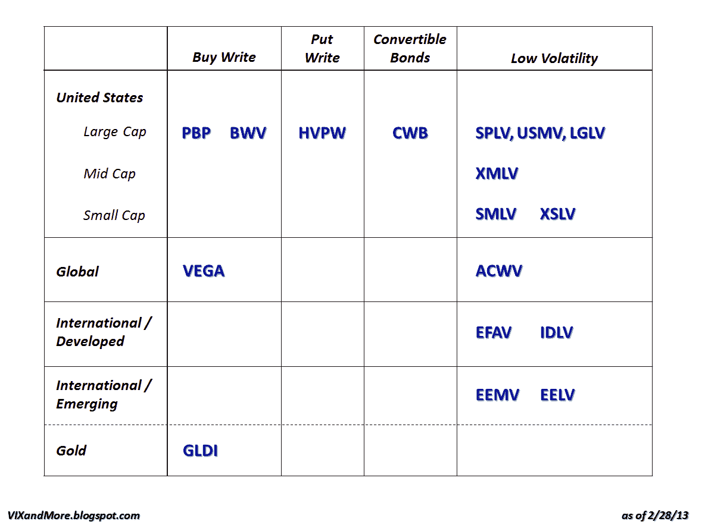

<!--yml
category: 未分类
date: 2024-05-18 16:17:51
-->

# VIX and More: The Options and Volatility ETPs Landscape

> 来源：[http://vixandmore.blogspot.com/2013/02/the-options-and-volatility-etps.html#0001-01-01](http://vixandmore.blogspot.com/2013/02/the-options-and-volatility-etps.html#0001-01-01)

For several years I have publishing a graphical overview of the [VIX ETPs](http://vixandmore.blogspot.com/search/label/VIX%20ETN) landscape, with all the ETPs plotted on the basis of leverage and target maturity, such as the recent [VIX ETP Returns for 2012](http://vixandmore.blogspot.com/2013/01/vix-etp-performance-in-2012.html).

Lately, however, an expanding crop of options and volatility ETPs has been taking root in a space that is closer to the VIX products than any of the other ETPs. I talked about the low volatility ETPs at some length in yesterday’s [Beyond SPLV: The Expanding Universe of Low Volatility ETPs](http://vixandmore.blogspot.com/2013/02/beyond-splv-expanding-universe-of-low.html).

The graphic below is a plot of these securities, with the their geography, market cap and asset class in the rows and strategy/approach in the columns. I have talked about [PBP](http://vixandmore.blogspot.com/search/label/PBP) in this space and was particularly interested to see that the [buy-write](http://vixandmore.blogspot.com/search/label/buy-write) / [covered call](http://vixandmore.blogspot.com/search/label/covered%20calls) approach is now being applied to gold in the form of the recent launch of [GLDI](http://vixandmore.blogspot.com/search/label/GLDI).

Part of what prompted today’s approach is the launch of U.S. Equity High Volatility Put Write Index ETF ([HVPW](http://vixandmore.blogspot.com/search/label/HVPW)), which is the first [put-write](http://vixandmore.blogspot.com/search/label/put-write) ETP on the market. I have talked about put-write strategies and the CBOE S&P 500 PutWrite Index ([PUT](http://vixandmore.blogspot.com/search/label/PUT)) at some length here in the past and have included some links below for additional reading.

In the [convertible bond](http://vixandmore.blogspot.com/search/label/convertible%20bonds) space, [CWB](http://vixandmore.blogspot.com/search/label/CWB) has been the most popular ETP in this space for the last few years. Earlier this week, PowerShares closed its competing Convertible Securities Portfolio ETF (CVRT), essentially ceding this space to CWB for now.

The other portion of the graphic below is my attempt at translating much of yesterday’s text into a format that makes for a more handy reference.

I will keep tabs on all of these ETPs going forward and in particularly look to see how HVPW and GLDI do in terms of both risk-adjusted performance and investor acceptance. I certainly hope it does not take investors as long to discover these products as it did for them to warm up to the likes of [ZIV](http://vixandmore.blogspot.com/search/label/ZIV).

Related posts:

***Disclosure(s):*** *long PBP at time of writing*