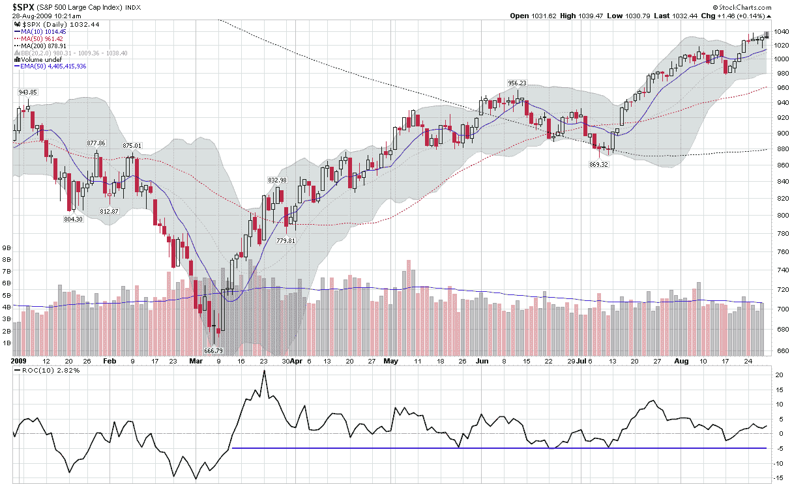

<!--yml
category: 未分类
date: 2024-05-18 17:31:49
-->

# VIX and More: The Other Side of Fear and Panic

> 来源：[http://vixandmore.blogspot.com/2009/08/other-side-of-fear-and-panic.html#0001-01-01](http://vixandmore.blogspot.com/2009/08/other-side-of-fear-and-panic.html#0001-01-01)

Joshua Brown at [The Reformed Broker](http://thereformedbroker.com/) has a nice piece out this morning (hat tip, [Trader Mike](http://tradermike.net/)) with the playful title of [The Five Stages of Panic Buying](http://thereformedbroker.com/2009/08/27/the-five-stages-of-panic-buying/). Brown illustrates each of the five stages with quotes from through the investment management world and in so doing has reconstructed something of a psychological history of the current bull market. Both bulls and bears are encouraged to click through to get a chuckle out of what has been going on in the head of investors for the past 5-6 months.

The underlying theme of all five stages is that on Wall Street, where annual bonuses are typically doled out based on performance relative to a benchmark, investment managers loathe the idea of falling behind that benchmark early in the year and having to play catch-up for the balance of the year. Particularly in a year when the market starts down then reverses sharply to the upside, one would expect that a large majority of investment managers would find themselves chasing performance, becoming more aggressive and taking on more risk in order to reel in the benchmark.

Of course, panic buying is not the flip side of panic selling. Panic buying favors the use of more derivatives, more leverage, more beta and less cash. It shows up on charts as aggressive buying on the dip, the failure of stocks to retrace earlier gains, etc. and is part of the reason why the 10 day [rate of change](http://vixandmore.blogspot.com/search/label/rate%20of%20change) (ROC) in the chart below has yet to fall below -5 (%) since the rally began.

What I find particularly interesting is that I believe panic buying is more likely to lead to crowded trades and ultimately to panic selling. There have not been many days in which we have seen big drops in the SPX and there has certainly been no extended weakness in stocks since the March bottom, but I suspect that when the market finally does turn, those same panic buyers will be quick to lock in gains in hopes of keeping pace with or finally overtaking the appropriate benchmark.

So…if we have many panic buyers who have been chasing performance with long positions of questionable underlying value, then the potential for some high volatility trading in the next month or so may be higher than recent stock market activity has led many to believe.

*[graphic: StockCharts]*