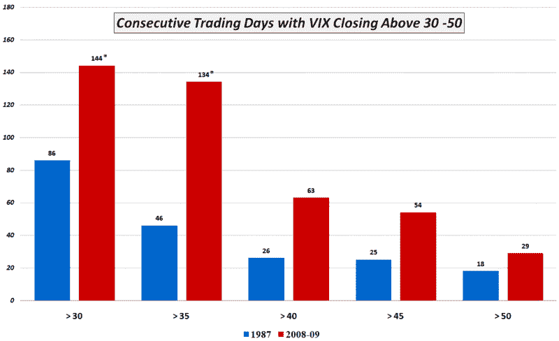

<!--yml
category: 未分类
date: 2024-05-18 17:52:39
-->

# VIX and More: The Persistence of Volatility

> 来源：[http://vixandmore.blogspot.com/2009/04/persistence-of-volatility.html#0001-01-01](http://vixandmore.blogspot.com/2009/04/persistence-of-volatility.html#0001-01-01)

I have often thought that Salvador Dali’s [The Persistence of Memory](http://en.wikipedia.org/wiki/The_Persistence_of_Memory), with its famous melting clocks, should be the official painting of all options traders, for if there is anything that distorts time, it is the wild permutations of the positions and mind of an options trader.

With the VIX closing at 36.53 today, the lowest close since September 26^(th), volatility and time seem to be warping once again. After weeks of bouncing off of the 40 level, the VIX appears to finally be headed in the direction of pre-Lehman levels.

The six and a half months of persistent volatility has me thinking that it is a good time to compare the volatility trends of 2008-2009 with the only other period of high implied volatility on record, the [1987](http://vixandmore.blogspot.com/search/label/1987) crash.

The chart below shows that [VIX spikes](http://vixandmore.blogspot.com/search/label/VIX%20spikes) from 1987 spent 86 consecutive trading days above 30 and roughly a month over 40, 45 and 50\. In contrast, the 2008-09 financial crisis witnessed three months (63 trading days) in a row with the VIX above the 40 level and an impressive 134 and 144 days above the 35 and 30 levels, with those records still ongoing. This is not to say that the 144 day string is getting too long in the tooth, only that we are in well into uncharted territory when it comes to implied volatility.

Of course there are no implied volatility data going back to the Great Depression, but the 30 day historical volatility, a reasonable proxy for the VIX, was able to remain above the 30 level for 16 long months from September 1931 to January 1933\. If the VIX stays above 30through Memorial Day, that will mark the halfway point of the 1931-1933 record.

*[source: VIXandMore]*