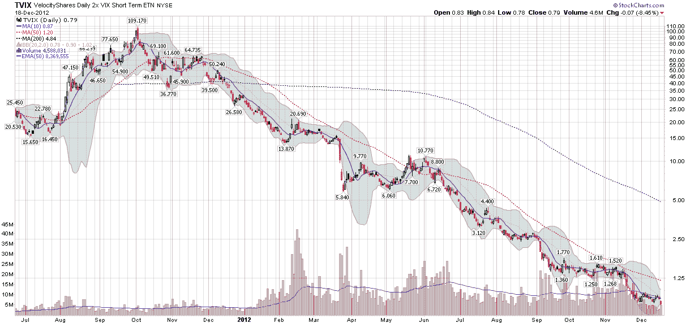

<!--yml
category: 未分类
date: 2024-05-18 16:20:46
-->

# VIX and More: The Resurrection of TVIX

> 来源：[http://vixandmore.blogspot.com/2012/12/the-resurrection-of-tvix.html#0001-01-01](http://vixandmore.blogspot.com/2012/12/the-resurrection-of-tvix.html#0001-01-01)

It has been quite a year for [TVIX](http://vixandmore.blogspot.com/search/label/TVIX), formally known as the VelocityShares Daily 2x VIX Short-Term ETN. At the beginning of 2012, TVIX was trading about a million shares per day and was known to only a small group of investors that followed the [VIX exchanged-traded products](http://vixandmore.blogspot.com/search/label/VIX%20ETN) space. By the middle of February, however, volume in TVIX had soared to 40 million shares, making it the volume leader in the VIX ETP space. It seemed as if TVIX had made the jump from relative obscurity to headline-grabbing rock star status with stunning swiftness and almost no effort.

TVIX soon became a victim of its own success, a fact which was confirmed when Credit Suisse ([CS](http://vixandmore.blogspot.com/search/label/CS)) [announced](http://vixandmore.blogspot.com/2012/02/credit-suisse-suspends-creation-units.html) on February 21^(st) that it had “temporarily suspended further issuances of the VelocityShares Daily 2x VIX Short-Term ETNs ([TVIX](http://vixandmore.blogspot.com/search/label/TVIX)) due to internal limits on the size of the ETNs.” I covered [this story](http://vixandmore.blogspot.com/2012/02/credit-suisse-suspends-creation-units.html) and the subsequent fallout in depth and will not repeat the particulars here (see links below for more information) other than to note that the absence of a supply of new creation units led to a substantial imbalance between supply and demand, with the result that the price of TVIX soared relative to its [Intraday Indicative Value](http://vixandmore.blogspot.com/search/label/intraday%20indicative%20value) (a real-time estimate of an ETP’s fair value, based on the most recent prices of its underlying securities) and became almost completely unhinged from any reasonable estimate of fair value. The extreme price dislocation persisted for a little over a month, until Credit Suisse [agreed](http://vixandmore.blogspot.com/2012/03/tvix-creation-units-return-what-it.html) to reopen the issuance of creation units “on a limited basis” on March 22^(nd). To make a long story short, the price collapsed by more than 50% in two days in the wake of this announcement (see the gap down in the chart below), many investors suffered huge losses and a slew of law suits were not far behind.

*[source(s): StockCharts.com]*

Credit Suisse allowed the price of TVIX to fall below 10.00 in late March and below 5.00 in late June, by which time I removed it from my radar screen and replaced it with a similar product, [UVXY](http://vixandmore.blogspot.com/search/label/UVXY), which has the additional benefit of being optionable. When TVIX slipped below 1.00 last month, I assumed that Credit Suisse had consigned the ETN to a slow and painful death.

Not so fast.

Late last Friday, Credit Suisse [announced](http://finance.yahoo.com/news/credit-suisse-ag-announces-reverse-011500337.html) a 1-10 reverse split, effective Friday (December 21^(st)) at the open. At today’s close of 0.79, a 1-10 split would bring TVIX back up to just 7.90, which is where the ETN was trading in June.

Based on this news, I can only conclude that Credit Suisse intends to resurrect TVIX, which, much to my amazement, still has more assets than UVXY ($110 million vs. $100 million.)

As I see it, this is still a case of too little, too late. At 7.90, TVIX is only one bad month away from slipping below the critical 5.00 level where most brokers begin to place significant restrictions on shorting. In terms of timing, where was Credit Suisse in April or May, when UVXY was taking significant mind share and market share from TVIX and a reverse split could have stemmed that tide?

Having made the switch to UVXY as my favored product for the +2x VIX ETP space, I am now quite comfortable with a product that has an active options market associated with it and have difficulty seeing the rationale for switching back to TVIX, particularly since UVXY has also had substantially more liquidity as of late.

A number of notable VIXophiles are not even aware that TVIX is going through a reverse split, so this is likely to be an uphill battle for Credit Suisse. Ultimately, the burden of proof is back on TVIX – and on Credit Suisse – to persuade investors that the resurrection of this left-for-dead product is worth trading. As someone who has been an avid follower of TVIX from the day it was launched and who was writing about TVIX long before it was popular, count me as skeptical, but interested to see how the UVXY vs. TVIX drama plays out.

Related posts:

***Disclosure(s):*** *short UVXY at time of writing*