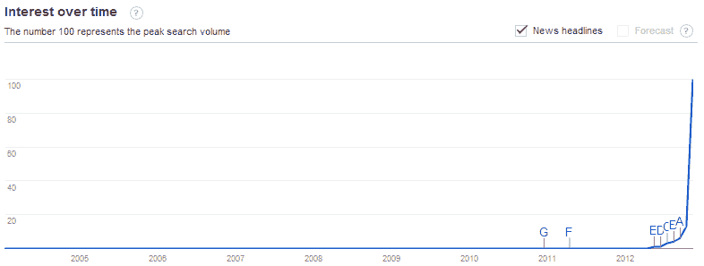
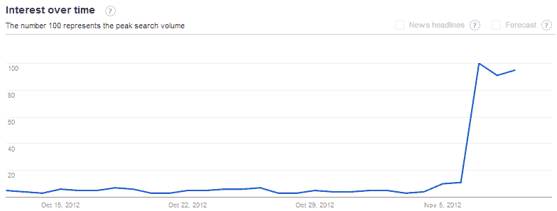

<!--yml
category: 未分类
date: 2024-05-18 16:23:04
-->

# VIX and More: The Rise of Fiscal Cliff Concerns

> 来源：[http://vixandmore.blogspot.com/2012/11/the-rise-of-fiscal-cliff-concerns.html#0001-01-01](http://vixandmore.blogspot.com/2012/11/the-rise-of-fiscal-cliff-concerns.html#0001-01-01)

How much of the recent selloff in stocks has been triggered by media’s sudden obsession with the U.S. [fiscal cliff](http://vixandmore.blogspot.com/search/label/fiscal%20cliff)? Is it possible that very little has changed under the surface, but the decibels associated with this issue are now off the charts?

For the last three weeks, *VIX and More* [Fear Poll](http://vixandmore.blogspot.com/search/label/Fear%20poll) respondents have rated the issues surrounding the U.S. fiscal cliff as their biggest source of fear about the future of the stock market. Now that the election is behind us and the earnings season is winding down, these fears have been buttressed by a huge amount of media scrutiny suddenly being devoted to the subject.

The fiscal cliff is one of those issues that has been on the horizon for many months, but only recently have investors begun to pay attention to the problem. Part of the reason for this sudden interest in the fiscal cliff is that Congress and the Obama Administration were not going to address the fiscal cliff during the campaign season and consequently no one expected any progress on the fiscal cliff issues during this period. Now that the election is over, the issue is seen as a ticking time bomb, with a much shorter fuse each day.

While politicians, economists and business leaders across the globe have called for a speedy resolution of the fiscal cliff negotiations between Democrats and Republicans, the highly respected Congressional Budget Office added some new urgency to the dialogue with the publication of two new documents on Thursday:

1.  [Economic Effect of Policies Contributing to Fiscal Tightening in 201](http://www.cbo.gov/sites/default/files/cbofiles/attachments/11-08-12-FiscalTightening.pdf)3

2.  [Choices for Deficit Reduction](http://www.cbo.gov/sites/default/files/cbofiles/attachments/43692-DeficitReduction_print.pdf)

I cannot say that I pay much attention to the likes of CNBC and Bloomberg TV, but I understand that the fiscal cliff issue is now dominating the business television airwaves as well.

All this makes me wonder just how much of the recent selloff in stocks is driven by substance and how much is driven by the media frenzy.

I took a look at the [Google Trends](http://vixandmore.blogspot.com/search/label/Google%20Trends) data for “fiscal cliff” and discovered that the issue barely registered on Google’s radar until about May of this year.

*[source(s): Google Trends]*

There was an occasional mention of the fiscal cliff up through last Sunday, then on Monday, the day before the U.S. election, new interest in the subject began to surface. The big spike in interest in the fiscal cliff happened on the day following the election, when Google search volume in “fiscal cliff” rose tenfold and the media frenzy began.

*[source(s): Google Trends]*

Over the weekend, concerns about the fiscal cliff have been [outpolling](http://vixandmore.blogspot.com/2012/11/weekly-vix-and-more-fear-poll.html) (voting is still open) concerns about the ongoing [European sovereign debt crisis](http://vixandmore.blogspot.com/search/label/European%20sovereign%20debt%20crisis) by the largest margin yet. The real question is whether this is due largely to a redirection of attention by the media and by investors or by changes in the underlying nature of the issue or the likelihood of a timely resolution to the problem. My guess is that more of the former is at work than the latter.

Related posts:

***Disclosure(s):*** *none*