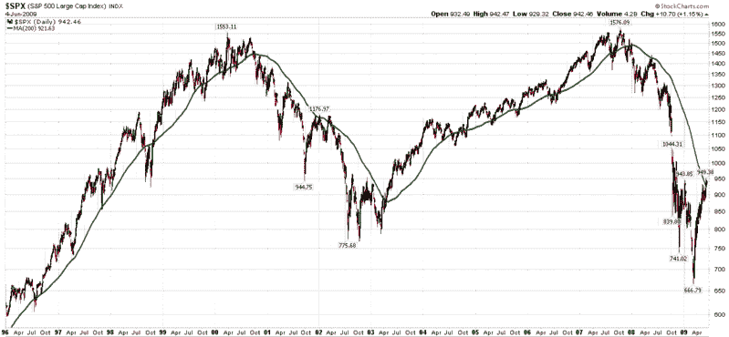
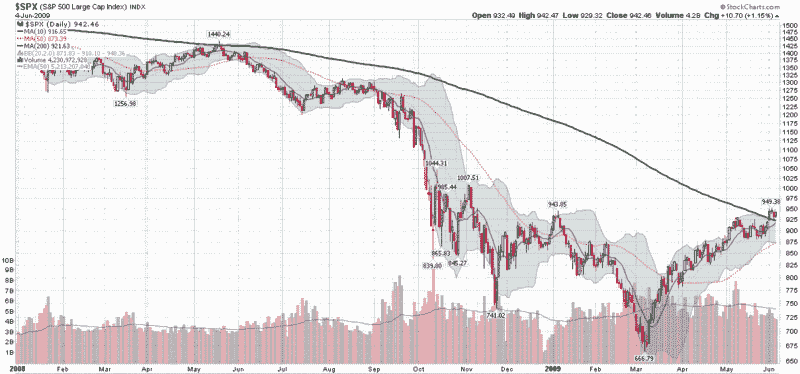

<!--yml
category: 未分类
date: 2024-05-18 17:44:25
-->

# VIX and More: The SPX and the 200 Day Moving Average

> 来源：[http://vixandmore.blogspot.com/2009/06/spx-and-200-day-moving-average.html#0001-01-01](http://vixandmore.blogspot.com/2009/06/spx-and-200-day-moving-average.html#0001-01-01)

Lately there has been a great deal of talk related to the SPX closing above its 200 day moving average for the first time since the end of 2007.

The first question traders should ask themselves is whether this technical artifact has any relevance to trading. The simple answer is that it depends upon how many people pay attention to the 200 day moving average and incorporate rules related to it in their trading methodologies. For example, there are many traders who prefer – or insist upon – long positions only when the instrument in question is above its 200 day moving average and short positions only when it is below the 200 day moving average. In sum, if enough people pay attention to the 200 day moving average, it becomes a self-fulfilling prophecy of sorts.

But is there an edge in incorporating the 200 day moving average into trading decisions? Condor Options took up this subject earlier today in [Exponentially Curb Your Enthusiasm](http://www.condoroptions.com/index.php/market-commentary/exponentially-curb-your-enthusiasm/) and concluded that since 1965, long only strategies that incorporated the 200 day simple moving average (SMA) and exponential moving average (EMA) for the SPX both beat a simple buy and hold approach. (Interestingly, the EMA approach had a better track record than the SMA approach.)

A quick glance back at a long-term SPX chart show why the 200 day SMA has helped generate excellent timing signals. Note that from 1996-2000 and 2003-2007, the 200 day SMA kept investors in the bull market almost all the time. Investors would have been in cash (or perhaps even short) during the 2000-2003 bear market and from the beginning of 2008 to the present.

Looking at the SPX since the beginning of 2008, one can see the steady decline in the 200 day SMA, which actually peaked in January 2008.

Before getting too excited about the 200 day SMA, it is important to look under the hood at the data that goes into the calculations. Right now, the 200 day window includes data going back to August 19, 2008, when the SPX closed at 1266.69\. Tomorrow that number will be dropped from the calculations and replaced with one that is likely to be close to today’s close of 942.46\. That is 324 points lost from the index calculations, which means that if the markets drift sideways, the 200 day SMA will be declining at rate of about 1.6 points per day as the higher closes from August scroll off. In fact, since the beginning of 2009, the 200 day SMA has dropped 48, 46, 69, 46 and 37 points in each of the last five months.

Another factor to consider is that the lows of March 6^(th) and 9^(th) are now almost three calendar months behind us. That translates into 61 and 62 trading days. It also means that the March lows will be in the midpoint of the data series in 38-39 trading days, which means that the 200 day SMA is most likely to continue to decline until the last week in July before turning back up.

So, go ahead and consider the 200 day SMA to be a potential support level or long/short inflection point, but going forward, this line on the charts should continue to decline and be less and less relevant, unless, of course, the markets follow the green line down.

*[graphics: StockCharts]*