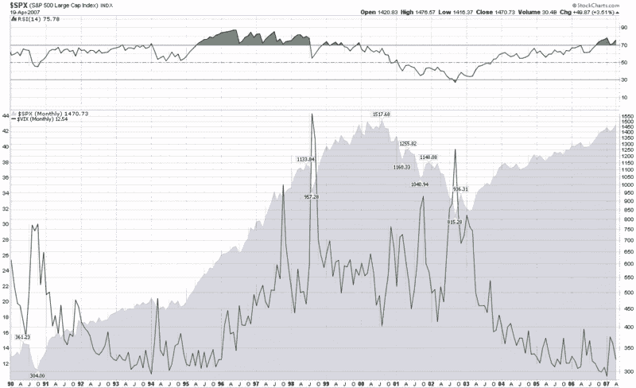

<!--yml
category: 未分类
date: 2024-05-18 15:48:39
-->

# VIX and More: The SPX and the VIX Revisited

> 来源：[http://vixandmore.blogspot.com/2007/04/spx-and-vix-revisited.html#0001-01-01](http://vixandmore.blogspot.com/2007/04/spx-and-vix-revisited.html#0001-01-01)

Several readers have inquired about whether the markets can continue to make new highs if the VIX is well above its all-time low.  My answer is a resounding “Absolutely!”  Frankly, I would expect new highs in the broad market indices to only rarely correspond to new lows in the VIX.

I present my thinking below, but before I get into the details, let me pose a question.  Assume I tell you that I have had a glimpse of the future and can guarantee that in 2050 the SPX will be trading at 100,000.  Now I ask you to guess what the VIX will be when the SPX hits that milestone.  What did you guess?  10?  11?  My guess would probably be 18 or 19, as the mean daily close of the VIX since 1990 currently stands at 18.95\. For the record, that 100,000 number is not all that outrageous either, as it represents 'only' a 10.1% [CAGR](http://www.moneychimp.com/calculator/discount_rate_calculator.htm), which is consistent with historical rates of return.

The big problem here, as I discussed in some detail in “[The SPX:VIX Relationship](http://vixandmore.blogspot.com/2007/02/spxvix-relationship.html)” is that we are attempting to compare one number that trends about 10% a year over the long-term with another value that oscillates around a mean of about 19.

Let me pull up a monthly chart of the SPX and the VIX going back to 1990 to illustrate my point (click for a larger image; also feel free to disable the [Snap](http://www.snap.com/) preview function with a click on the upper right hand corner of any previewed image if you so desire):

Look closely at the period from October 1994 through March 2000, which, of course, was a raging bull market in which the SPX increased by a multiple of about 4.5x and made hundreds of new all-time highs. What many may not realize is that the VIX was moving up steadily during this period as well, going from the 12-14 range to the mid-20s.  In fact, one should expect that given the oscillating nature of the VIX, there will be many bullish periods where the VIX actually goes sideways or rises. Only during extreme bullish complacency should we expect to see VIX readings in the 11-12 range and sub-10 may turn out to be a once a decade phenomenon.  Said another way: there is a fairly strong possibility we will not see a sub-8 VIX this century, yet by the end of the century there is a good chance that the SPX will have something like 39 digits in it.

One other factor to consider about the current state of the VIX and market indices is [echo volatility](http://vixandmore.blogspot.com/search/label/echo%20volatility), which I have spoken about at length here in the past.  While some who may be buying stocks may feel like the big volatility spike is behind us, others, [like my dog](http://vixandmore.blogspot.com/2007/01/what-my-dog-can-tell-us-about_947.html), are firm believers in volatility clusters – and with good reason.

In summary, [time horizons](http://vixandmore.blogspot.com/search/label/time%20horizon) are important, but it is even more important to know when you are comparing trending numbers with oscillating ones.  For one potential resolution to the SPX-VIX conundrum, you might wish to take a look at my previous posts on the [SPX:VIX](http://vixandmore.blogspot.com/search/label/SPX%3AVIX) ratio.