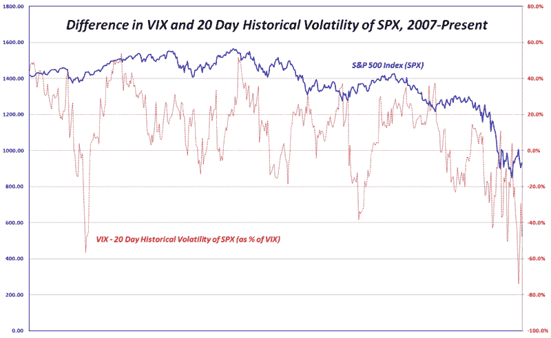

<!--yml
category: 未分类
date: 2024-05-18 18:17:02
-->

# VIX and More: The Spread Between the VIX and 20 Day Historical Volatility in the SPX

> 来源：[http://vixandmore.blogspot.com/2008/11/spread-between-vix-and-20-day.html#0001-01-01](http://vixandmore.blogspot.com/2008/11/spread-between-vix-and-20-day.html#0001-01-01)

In the last few weeks I have received a lot of positive feedback on my posts about the VIX and [historical volatility](http://vixandmore.blogspot.com/search/label/historical%20volatility) in the SPX. For those who may have missed it, you may wish to start with [The VIX in the Context of Historical Volatility in the SPX](http://vixandmore.blogspot.com/2008/10/vix-in-context-of-historical-volatility.html) and [The VIX – SPX 30 Day Historical Volatility Spread and Performance](http://vixandmore.blogspot.com/2008/11/performance-and-vix-and-spx-30-day.html).

Today Todd Salamone of SchaeffersResearch.com has a [Monday Morning Outlook post](http://www.schaeffersresearch.com/commentary/observations.aspx?ID=89028&c=obsfeed) in which he observes:

> *“We are also closely watching the behavior of the CBOE Market Volatility Index (VIX – 56.10) from 2 perspectives. First, the VIX continues to trade at a steep discount to the SPX's 20-day historical volatility, which has begun to level off just above 80% during the past few weeks. Our interpretation of this development is that there is little fear of another major setback in the market. Typically, such fear leads to major market bottoms. If fear and panic were elevated, the VIX would be trading above the actual volatility of the SPX.*
> 
> *Second, we are keeping an eye on the 44-45 area in regard to the VIX. We think this area is important, as it marked last week's low, and represents the VIX's "half-high" achieved on October 24\. Moreover, this area is currently home to the VIX's rising 50-day moving average.”*

While both points are interesting ones, it is the historical volatility piece that I wish to comment on here. Starting with some history, since 1990 the VIX has traded above the 20 day historical volatility of the SPX over 90.6% of the time, often in an uninterrupted fashion for months on end. The fact that the VIX is above 20 day historical volatility, therefore, says very little about elevated levels of fear and panic.

In the chart below, I have plotted the VIX minus the 20 day historical volatility in the SPX (expressed as a percentage of the VIX) from 2007 through Friday. In the chart, it is evident that when the VIX-HV is high, this generally tends to coincide with short-term bottoms in the SPX. The low levels of VIX-HV are not as easy to decipher. The two most dramatic VIX-HV lows on the chart both occurred after a low in the SPX and coincided with a several month uptrend in the SPX.

In the current environment, I would consider Tuesday’s record low in the VIX-HV ratio to be a signal that a near-term bottom is in the process of forming. I do not, however, see the need for the VIX to trade above the SPX’s 20 day historical volatility, as it did for one day on October 27^(th) for instance, to provide any confirmation signal.

[source: VIX and More]