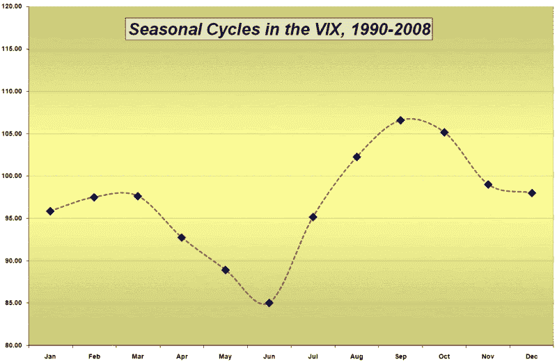

<!--yml
category: 未分类
date: 2024-05-18 18:09:19
-->

# VIX and More: The VIX Annual Cycle

> 来源：[http://vixandmore.blogspot.com/2008/12/vix-annual-cycle.html#0001-01-01](http://vixandmore.blogspot.com/2008/12/vix-annual-cycle.html#0001-01-01)

Two years ago, when I was the only person reading this blog, I posted about VIX [seasonal patterns](http://vixandmore.blogspot.com/search/label/seasonality) in [A Month By Month Look at the VIX](http://vixandmore.blogspot.com/2007/01/month-by-month-look-at-vix.html). Since the original post I have received quite a few requests to update the chart with more recent data.

On the heels of yesterday’s [VIX Holiday Crush](http://vixandmore.blogspot.com/2008/12/vix-holiday-crush.html), I am pleased to broaden the seasonal picture of the VIX with a current version of 19 years of VIX data as a composite [annual cycle](http://vixandmore.blogspot.com/search/label/annual%20cycle). The chart below has changed very little from the January 2007 version. In fact, 2008 followed the historical patterns established in previous years almost perfectly, with the VIX increasing in the January-March period, dropping through May and June, then spiking dramatically in September and October.

I have my doubts about whether this pattern will play out in future years, but the more times volatility wanders down this same seasonal path, the more time traders will be looking for a repeat in the following year.

*[source: VIX and More]*