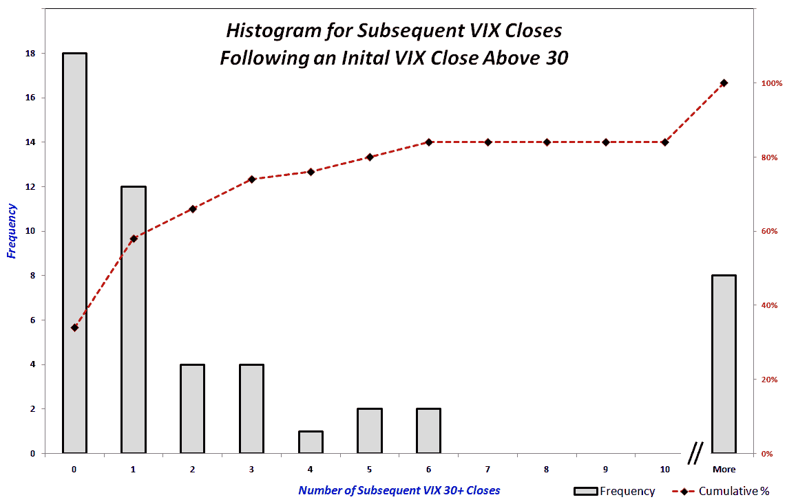

<!--yml
category: 未分类
date: 2024-05-18 17:23:45
-->

# VIX and More: The VIX Spike Conundrum

> 来源：[http://vixandmore.blogspot.com/2009/11/vix-spike-conundrum.html#0001-01-01](http://vixandmore.blogspot.com/2009/11/vix-spike-conundrum.html#0001-01-01)

I have been absolutely astonished by the number of comments I have seen in the past few days to the effect that right now is an excellent time to initiate new long positions on VIX options. I am still not sure what is behind most of this thinking, but it seems as if quite a few investors are excited about the VIX breakout, some have adopted a Roubiniesque pervasive pessimism and others clearly are still operating under the shadow of the 2008 volatility spikes.

For all those who think that a [VIX spike](http://vixandmore.blogspot.com/search/label/VIX%20spikes) of 50% is a good time to get long the VIX, my response is that your ship has already sailed.

I gave this post the title of *The VIX Spike Conundrum* because like a hot [Chinese solar stock](http://vixandmore.blogspot.com/2008/04/chinese-solar-stocks-on-rise.html), a rising VIX seems to be attracting the momentum crowd. Betting that a 50% rise in the VIX is just the beginning of a larger move is a sucker’s bet. In the event that readers find the data in the two studies linked at the bottom of this post not to be sufficiently compelling, I have added a new study that looks at what happens to the VIX following the first time it spikes high enough to close above 30\. Not surprisingly, it is yet another example of [mean reversion](http://vixandmore.blogspot.com/search/label/mean%20reversion) at work.

The graphic below is a histogram that summarizes the future VIX action after an initial close above 30\. Of the 51 instances the VIX closed above 30 without having closed above 30 in the previous session, 18 times the VIX closed below 30 on the next day and an additional 12 instances reflect the VIX closing below 30 two days hence. This means that 59% of the time the VIX has surrendered the full distance of the close above 30 as well as some additional territory in just two days. Looking out four days, the VIX has already closed below 30 some 75% of the time, as is shown by the dotted red line.

Note that while 84.3% of the time the VIX has already closed below 30 just six days later, the remaining 15.7% of the instances can make or break a trader. Six times (11.8%) the VIX has remained above the 30 level for at least 23 consecutive days following the first close above 30\. This is slightly more than one full options cycle. Prior to October 2008, traders who were short VIX calls could reasonably expect that the VIX was not going to spike any higher than 45, which was the [all-time record in the VIX](http://vixandmore.blogspot.com/2008/09/top-five-vix-spikes.html) at that time. Now that we have had front row seats to witness the VIX spike above 80 on two separate occasions, I suspect investors overestimate the likelihood of a VIX spike of this magnitude happening again. Short of another acute systemic threat, I would be quite surprised to see the VIX rising over the 45 level.

In the current market environment, the odds favor short volatility positions, such as [bear call spreads](http://vixandmore.blogspot.com/search/label/bear%20call%20spread) on the VIX. Long positions in VIX calls are not just low probability plays, but they are very expensive as well. I don’t mind, however, if speculators are eager to gobble these up, as I am glad to have a ready audience to buy some VIX calls.

For related posts on this subject, readers are encouraged to check out:

***Disclosure****: Short VIX at time of writing.*