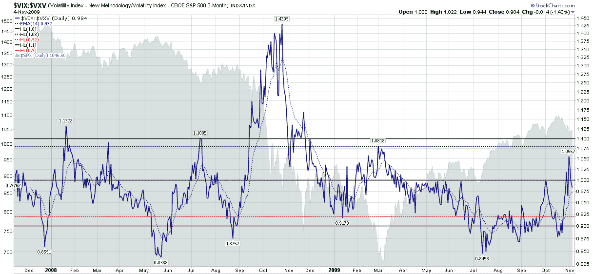

<!--yml
category: 未分类
date: 2024-05-18 17:23:30
-->

# VIX and More: The VIX:VXV Ratio, Availability Bias and Disaster Imprinting

> 来源：[http://vixandmore.blogspot.com/2009/11/vixvxv-ratio-availability-bias-and.html#0001-01-01](http://vixandmore.blogspot.com/2009/11/vixvxv-ratio-availability-bias-and.html#0001-01-01)

Once a popular subject in this space, the [VIX:VXV ratio](http://vixandmore.blogspot.com/search/label/VIX%3AVXV) appeared to be a casualty of the financial turmoil and record volatility spikes in October 2008, when the ratio spiked to record levels an generated a buy signal that turned out to be nothing short of a disaster.

I was not yet ready to give up on the VIX:VXV ratio, so I was pleased to see that from November to January it generated some helpful long and short signals. In a promising development, on March 2^(nd) the ratio generated a buy signal just before the markets bottomed. When the VIX:VXV ratio urged caution in June, I had even more reason to be hopeful. Then, once again, the ratio had another big miss, issuing a sell signal in mid-July just after the markets started rallying. To compound matters, instead of moving back toward the neutral zone (between 0.92 and 1.08), the ratio persisted with a bearish recommendation all the way to the October top.

I was just about to consign the VIX:VXV ratio to the “Sometimes Useful But Not Always Consistent” bin, but decided to reconsider when I started thinking about volatility levels in the context of [availability bias](http://vixandmore.blogspot.com/search/label/availability%20bias) and [disaster imprinting](http://vixandmore.blogspot.com/search/label/disaster%20imprinting), as well as [The Gap Between the VIX and Realized Volatility](http://vixandmore.blogspot.com/2009/08/gap-between-vix-and-realized-volatility.html) and [VIX Spike and VIX Futures Contango Means…](http://vixandmore.blogspot.com/2009/10/vix-spike-and-futures-contango-means.html) As I see it, all these subjects are related. The [realized volatility](http://vixandmore.blogspot.com/search/label/realized%20volatility) gap, persistent VIX futures [contango](http://vixandmore.blogspot.com/search/label/contango) and off-center VIX:VXV ratio (see chart below) are all symptoms of a market that is not functioning as it normally does, while availability bias and disaster imprinting are the main causes of this situation.

Further, the fact that the VIX futures term structure is now flat and the VIX:VXV ratio hit a new post-March 6^(th) high of 1.056 last Friday suggests that the volatility picture may be starting to assume some of its pre-Lehman characteristics – if not exactly returning to a ‘normal’ state of affairs.

Personally, I still think the VIX is a little higher now than realized volatility will be a month from now, but a high VIX relative to realized volatility may turn out to be one of the more persistent effects of the global financial crisis, as each investor has their own personal half-life for how long availability bias and disaster imprinting will cast a shadow on their view of the investment landscape.

For additional posts on some of the above subjects, readers are encouraged to check out:

*[source: StockCharts]*

***Disclosure****: Short VIX at time of writing.*