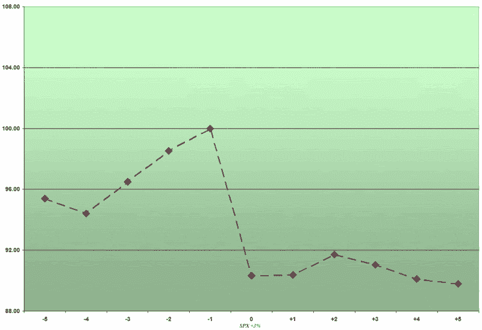

<!--yml
category: 未分类
date: 2024-05-18 16:00:54
-->

# VIX and More: The VIX and 3% SPX Rises

> 来源：[http://vixandmore.blogspot.com/2007/02/vix-and-3-spx-rises.html#0001-01-01](http://vixandmore.blogspot.com/2007/02/vix-and-3-spx-rises.html#0001-01-01)

[Last week](http://vixandmore.blogspot.com/2007/02/vix-and-3-spx-drops.html) I looked at what happens to the VIX leading up to and following a 3% drop in the SPX. Turning to the VIX in the five days before and after a 3% rise in the SPX, the composite visual of these 26 data points is much less compelling:

I previously noted that while the VIX surging an average of 10% in the four days prior to the SPX drop might have put some on notice that fireworks could be on the horizon, given the VIX's beta of -7 to -8, there were enough 'false alarm' 10% moves in four days to make this a weak predictive signal. Looking the VIX in the five days before and after a 3% rise in the SPX, any predictive value in a VIX move is much weaker, on the order of 5% on average during the three days prior to the 3% VIX jump.

Two other comparative points are worth noting here:

*   Whereas a 3% or more drop in the SPX spiked the VIX 14.3%, on average, a 3% rise in the VIX only moved the VIX down 9.7%, on average
*   While the VIX retraced 70% of its gains in the five days following the 3% SPX drop, when the SPX jumped 3%, the VIX was below the -9.7% drop and still moving lower four and five days after the SPX move

I will return to the asymmetrical mean reversion tendencies of VIX spikes in future posts here, but for now I will conclude by puting forth the following working hypothesis:

the widely accepted belief that the VIX generally reverts to the mean is more valid for sharp VIX moves up than sharp VIX moves down.