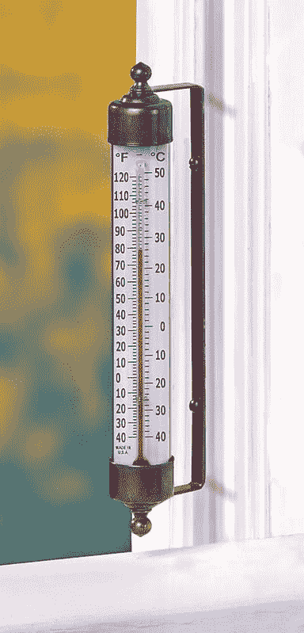

<!--yml
category: 未分类
date: 2024-05-18 18:42:30
-->

# VIX and More: The VIX and Going Short

> 来源：[http://vixandmore.blogspot.com/2008/02/vix-and-going-short.html#0001-01-01](http://vixandmore.blogspot.com/2008/02/vix-and-going-short.html#0001-01-01)

A reader asked about the feasibility of the declining VIX providing an entry signal for new short positions.  Specifically, he noted that [his weekly chart of the VIX](http://stockcharts.com/h-sc/ui?s=%24VIX&p=W&b=5&g=0&id=p71890196213), which utilizes a 43 week simple moving average, has contained all the action in the VIX over the past year or so, with that 43 week SMA acting as support.  Ultimately, his question concerns whether I believe that the 43 week SMA is likely to hold.

Before I get to the details of that question, let me reiterate my general thinking about using traditional technical analysis on the VIX.  In a nutshell, I believe that because the VIX is a derivative (more accurately [a derivative of a derivative](http://vixandmore.blogspot.com/2007/05/vix-futures-starter-kit.html)), traditional technical analysis has only limited validity.  This is particularly noteworthy when it comes to support and resistance.  If the VIX hits 20, for instance, nobody can rush in and buy the VIX to support it at that level, because one cannot buy and sell the cash VIX.  Sure, some may use a VIX of 20 as a rationale for starting to buy VIX options or futures, but the impact of these transactions on the cash VIX is indirect and weak.  The impact becomes a little stronger if traders use VIX signals to buy SPX options, but I still prefer to think of the VIX as more of a thermometer than an actual weather phenomenon.  Even a major deity would have trouble adjusting the sunshine, clouds and other factors to make the temperature read exactly 60 °F on your back porch.

So my bias is generally against moving averages as providing meaningful support and resistance for the VIX, given that I believe an arithmetic mean of a derivative of a derivative is not a meaningful number.  I do believe, however, that previous intermediate and long-term highs and lows in the VIX (e.g., January’s 37.57), round numbers (20, 25, 30, etc.), and deviations of significant magnitude from various moving average (% of 10 day SMA, etc.) can signal (or perhaps even trigger) important psychological milestones and provide high probability entries.

My conclusion, therefore, is that the 43 week SMA is more likely to hold if coincides with a previous low, round number or distance from certain critical SMAs.  Given the current numbers, I would say that strong support in the VIX is mostly likely to be found in the 19-20 range.

Just for fun, I have included three charts that provide three very different perspectives on the VIX.  The top chart is a basic chart of the VIX going back about a year.  As with the major indices, consolidation in the form of a triangle pattern is obvious, but with the VIX, the pattern reaches back to August.  The [VIX:VXV](http://vixandmore.blogspot.com/search/label/VIX%3AVXV) ratio chart shows the volatility expectations for the next 30 days (VIX) vs. the next 93 days ([VXV](http://vixandmore.blogspot.com/search/label/VXV)) – and these are middling at best.  The final chart shows a lifetime of the VIX graphed against the SPX, with a horizontal line showing the lifetime mean of the VIX (19.03) thrown in for good measure.  There are a number of potential conclusions to draw from these charts, but when I add them all together I come out neutral on the VIX, at least for the short to medium term time frame.

As an aside, when it comes to initiating new short positions, I don't like getting short until at least the third trading day of a new month, particularly with so much worried money sitting on the sidelines. Finally, in terms of support and resistance, I prefer to use the broad equity indices instead of the VIX to time entries and would watch SPX 1410 and [NDX](http://vixandmore.blogspot.com/search/label/NDX) 1900 more closely than the VIX, but keep a weather eye on a VIX of 19.