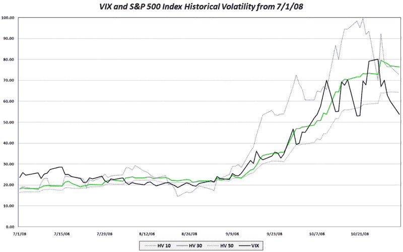

<!--yml
category: 未分类
date: 2024-05-18 18:17:40
-->

# VIX and More: The VIX and Lagging Historical Volatility

> 来源：[http://vixandmore.blogspot.com/2008/11/vix-and-lagging-historical-volatility.html#0001-01-01](http://vixandmore.blogspot.com/2008/11/vix-and-lagging-historical-volatility.html#0001-01-01)

By definition, [historical volatility](http://vixandmore.blogspot.com/search/label/historical%20volatility) will always be backward looking and lag the real-time volatility environment. When [volatility trends](http://vixandmore.blogspot.com/2008/10/vix-in-context-of-historical-volatility.html), as it has over the course of the past two months, this phenomenon is less evident. In the current market environment, however, where both stocks and [implied volatility](http://vixandmore.blogspot.com/search/label/implied%20volatility) measures such as the VIX are reversing, many measures of historical volatility begin to seem no more useful than driving on a winding road using the rear view mirror.

The graph below shows that while the 30 day historical volatility in the SPX peaked a week ago, it has only fallen 4% since that time. Not surprisingly, the 50 day historical volatility measure has been even less responsive to recent market changes and has entered a plateau phase, seemingly oblivious to the recent changes in volatility. By contrast, the 10 day historical volatility measure has dropped 27%; it has more accurately mirrored the VIX and perhaps even hinted at a coming VIX reversal when it topped three days before the VIX did.

Ten day historical volatility is erratic and prone to readings that reflect a low signal to noise ratio. When volatility is changing quickly, however, 10 day historical volatility is frequently a better proxy for the VIX and a more meaningful baseline for comparison than its 30 day sibling.

[source: VIX and More]