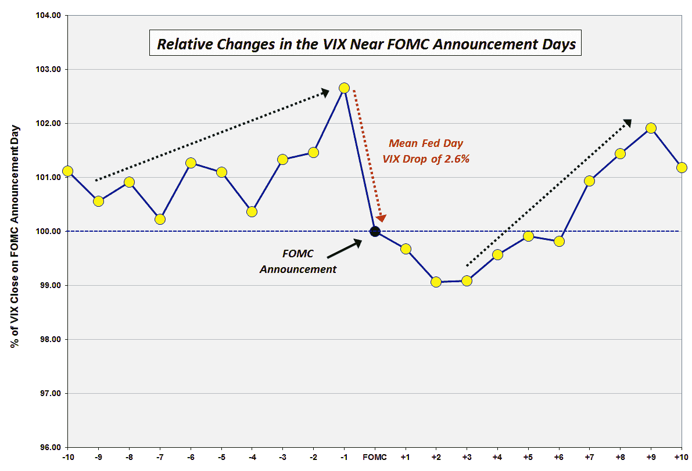

<!--yml
category: 未分类
date: 2024-05-18 16:15:45
-->

# VIX and More: The VIX and the Pre-FOMC + Post-FOMC Trades

> 来源：[http://vixandmore.blogspot.com/2013/06/the-vix-and-pre-fomc-post-fomc-trades.html#0001-01-01](http://vixandmore.blogspot.com/2013/06/the-vix-and-pre-fomc-post-fomc-trades.html#0001-01-01)

Back in December 2008, in [VIX Trends Around FOMC Announcement Days](http://vixandmore.blogspot.com/2008/12/vix-trends-around-fomc-announcement.html), I posted a chart of the average movements in the VIX in the ten trading day leading up to and following “[Fed Days](http://vixandmore.blogspot.com/search/label/Fed%20Days),” otherwise known as days in which the Federal Open Market Committee ([FOMC](http://vixandmore.blogspot.com/search/label/FOMC)) makes its policy statement announcement. Several long-time readers who recall that chart – and an earlier incarnation from [VIX Price Movement Around FOMC Meetings](http://vixandmore.blogspot.com/2007/01/vix-price-movement-around-fomc-meetings.html) – have recently asked for an updated version. With all eyes on the Fed’s statement and Ben Bernanke’s press conference on Wednesday, this seems like a good time to revisit how the VIX moves in the days leading up to and following FOMC announcements.

In the chart below, I have normalized VIX data going back to 1990 to make it easy to compare the mean daily changes in the VIX in the ten trading days preceding FOMC policy statement announcements as well as ten trading days following those announcements. The quick takeaway is that the data from the last five years has been consistent with the data as of 2008\. There are still three dominant features in this chart:

1.  a pre-FOMC VIX ramp in which the VIX tends to move up sharply in the three days leading up to the FOMC announcement and trend up more gradually 1-2 weeks in advance of the announcement
2.  a sharp decline in the VIX averaging about 2.6% on the day of the FOMC announcement, with a gradual decline in the VIX of another 1.0% or so in the two days following the announcement
3.  a sharp rebound in the VIX that starts three days after the FOMC announcement and persists until nine trading days after the announcement

Over the course of the past five years, the pre-announcement ramp in the VIX has been steeper during the three days prior to the announcement and more gradual in the week or so prior to that period. Also, recent history has seen the post-announcement decline in the VIX extending two additional days to now span four days following the announcement.

Of course there is no reason to expect that patterns which have persisted for the past 33 years to magically reappear for each FOMC announcement going forward, but I do believe that the historical pattern does say something about human nature, uncertainty and perceptions of [risk](http://vixandmore.blogspot.com/search/label/risk).

It is worth noting that the biggest one-day jump in the VIX on a Fed day dates from February 4, [1994](http://vixandmore.blogspot.com/search/label/1994), when Federal Reserve Chairman Alan Greenspan surprised the markets by announcing a 0.25% increase in the federal funds rate, helping to lift the VIX 41.9% on that day. For comparison purposes, the next largest Fed day VIX increase was a 15.1% gain on March 15, 2011\. While another VIX pop may be in the cards, history says there is a 72% chance the VIX will decline on Wednesday and that the decline should average about 2.6% or about 0.44 based on the current level of the VIX.

What is the trade here? While many will undoubtedly try to guess the direction of Wednesday’s move, the three other trades with a historical bias include:

1.  an increase in the VIX in advance of Wednesday’s announcement
2.  a continuation of any decline in the VIX from Thursday to Monday
3.  a new uptrend in the VIX beginning on Monday or Tuesday and running through the beginning of July.

*[source(s): CBOE, Yahoo, VIX and More]*

Related posts:

***Disclosure(s):*** *none*