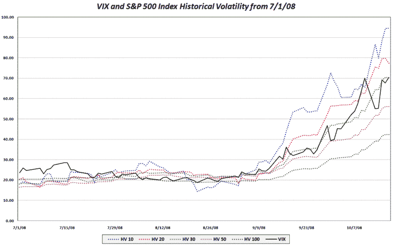

<!--yml
category: 未分类
date: 2024-05-18 18:20:03
-->

# VIX and More: The VIX in the Context of Historical Volatility of the SPX

> 来源：[http://vixandmore.blogspot.com/2008/10/vix-in-context-of-historical-volatility.html#0001-01-01](http://vixandmore.blogspot.com/2008/10/vix-in-context-of-historical-volatility.html#0001-01-01)

The chart below uses the same data (7/1 - 10/17/08) as the chart from the previous post , but adds the VIX to the mix to make it easy to see where the VIX has ranged relative to the [historical volatility](http://vixandmore.blogspot.com/search/label/historical%20volatility) of the SPX for the past few months.

[source: VIX and More]