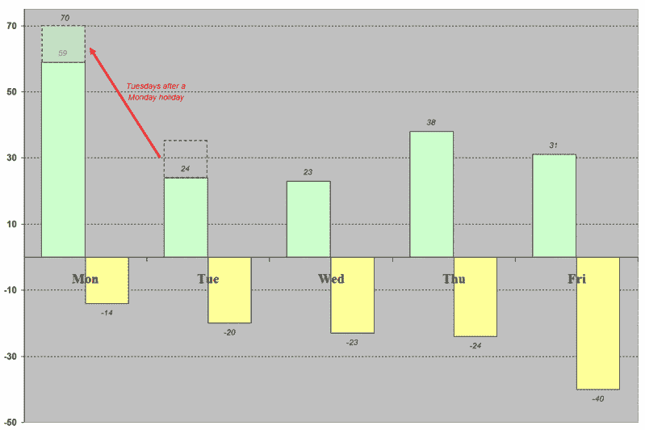

<!--yml
category: 未分类
date: 2024-05-18 15:59:39
-->

# VIX and More: The VIX on Mondays and Fridays

> 来源：[http://vixandmore.blogspot.com/2007/02/vix-on-mondays-and-fridays.html#0001-01-01](http://vixandmore.blogspot.com/2007/02/vix-on-mondays-and-fridays.html#0001-01-01)

It probably comes as no surprise to anyone who takes options seriously that the VIX is most likely to make a big move up or down on either Monday or Friday, but did you realize that the Friday moves are mostly up and the Monday moves are mostly down?

Today’s Excel cut and paste shows all the one day moves in the VIX of 10% or more since 1990.  For starters, 61% of these have been up, while 39% have been to the down side.  Monday sees by far the most VIX spikes up.  If you add the 11 moves of 10% or more that happened on Tuesdays when the markets were closed for a Monday holiday (i.e., those indicated by the red arrow and dashed box), the pattern of a large plunge on the first trading day of the week becomes even more predominant, with 70 sessions of a 10% or greater VIX move up (shown in green) versus only 14 sessions with a 10% move down.  On balance, Tuesdays and Wednesdays are relatively light in terms of large VIX moves to the upside, with activity picking up somewhat on Thursdays and Fridays.

Looking at 10% VIX moves down, the trend rides a slow and steady weekday crest, starting from a Monday low and moving up a little each day, with Friday the big winner in the spike down sweepstakes.

I am not yet ready to speculate on the causes of the Friday volatility drops and the Monday and post-holiday Tuesday VIX surges, other than to point out that even following 9/11, when the country appeared to hold its collective breath over the weekend, this pattern seemed to hold.

I will note that in the past couple of years, some of the patterns in the weekday trends may have weakened a little, but for the most part, they have held up in periods when the VIX has been at historically high levels as well as historically low levels.

There are many potential implications to be drawn from this data.  Specific to the [current rise in the level of the VIX](http://vixandmore.blogspot.com/2007/02/7-friday-vix-spikes.html), keep in mind that VIX spikes on a Tuesday or a Wednesday may have more significance than those that straddle the weekends.

For now I am bearish on the VIX and expect that the current VIX uptrend will run its course by Wednesday.  If it does not, however, I would think that 15 and perhaps 20 are in play before the month is over.