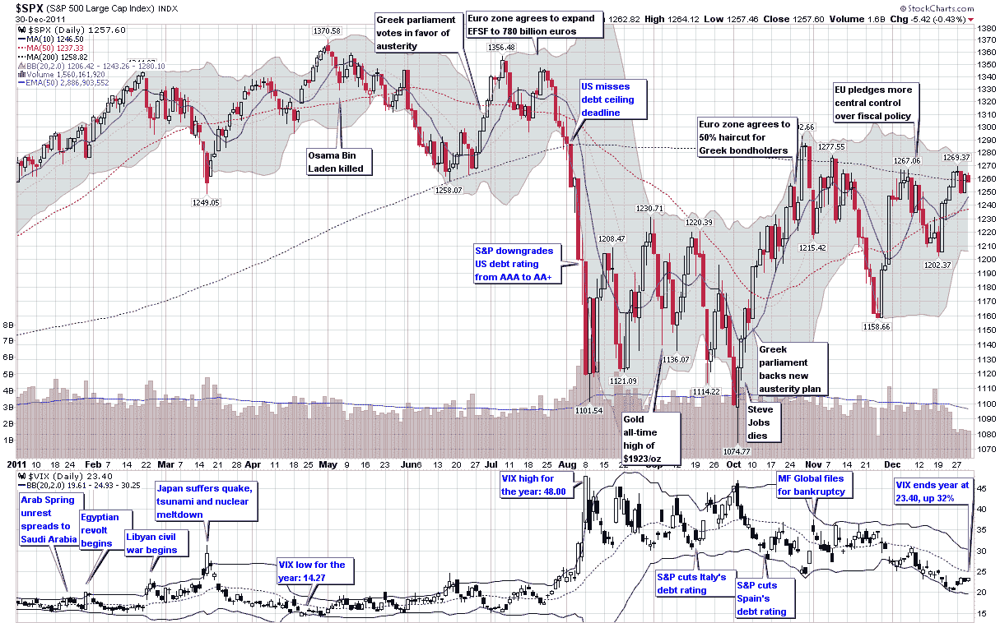

<!--yml
category: 未分类
date: 2024-05-18 16:44:25
-->

# VIX and More: The Year in VIX and Volatility (2011)

> 来源：[http://vixandmore.blogspot.com/2012/01/year-in-vix-and-volatility-2011.html#0001-01-01](http://vixandmore.blogspot.com/2012/01/year-in-vix-and-volatility-2011.html#0001-01-01)

One of the most-loved charts I assemble each year is my retrospective look at the year in volatility. I already touched on some of the highlights of [event volatility](http://vixandmore.blogspot.com/search/label/event%20volatility) in text form in [Expectations, Surprises and Fear in 2011](http://vixandmore.blogspot.com/2011/12/expectations-surprises-and-fear-in-2011.html), but this is one case in which I believe a picture does a better job of telling the story in the context of a timeline for the entire year.

From a volatility perspective, the first half of [2011](http://vixandmore.blogspot.com/search/label/2011) was relatively benign, even though the global social and economic fabric was ripped by [Arab Spring](http://vixandmore.blogspot.com/search/label/Arab%20Spring) and the Japanese trio of disasters which came in the form of the earthquake, tsunami and nuclear meltdown.

Things were much more promising during the middle of the year when the Greek parliament voted in favor of austerity and the euro zone agreed to expand the European Financial Stability Facility (EFSF) to €780 million.

For a while, there was considerable angst surrounding the bipartisan politics associated with the U.S. debt ceiling deadline at the beginning of August, but only after the Democrats and Republicans failed to come up with a meaningful debt reduction deal did investor anxiety shift back to Europe. Ironically, the downgrade of the U.S. debt from AAA to AA+ had very little impact on Treasury securities, which actually began to rally sharply after the downgrade. When Europe returned to the center stage, however, the [sovereign debt crisis](http://vixandmore.blogspot.com/search/label/Italy) was escalating rapidly and it was now [Italy](http://vixandmore.blogspot.com/search/label/Italy) that was in the crosshairs. The VIX shot up to 48 on August 8^(th) and was regularly above 30 through the end of November, setting a new record for persistent [backwardation](http://vixandmore.blogspot.com/search/label/backwardation) in the [VIX futures](http://vixandmore.blogspot.com/search/label/VIX%20futures) in the process.

The VIX was a high wire act throughout August and September, with multiple excursions into the 40s. Even after the S&P 500 index bottomed on October 4 at 1074, the VIX remained stubbornly elevated in October and November, before finally falling into the 20s in December. While the SPX was essentially unchanged for the year, the VIX ended 2011 at 23.40, up 31.8% over 2010’s close of 17.75\. At the same time, the VIX futures are calling for a VIX of between 29 and 30 by the mid-point of 2012, suggesting that volatility will climb higher once again in the coming months.

In a year where most asset classes struggled mightily, volatility was one of the few great long positions. With a higher starting point going into 2012, it will be difficult for the VIX to repeat its market-beating performance once again, but if the euro zone and some of the geopolitical flash points fail to make progress, 2012 may indeed be the year of the VIX.

Finally, since I had so many requests for a high-resolution version to download last year, I am going to preemptively offer a full resolution PNG screen capture of the graphic below for download [here](http://img683.imageshack.us/img683/7720/theyearinvixandvol2011.png).

Related posts:

******

*[source(s): StockCharts.com]*

**Disclosure(s):** none