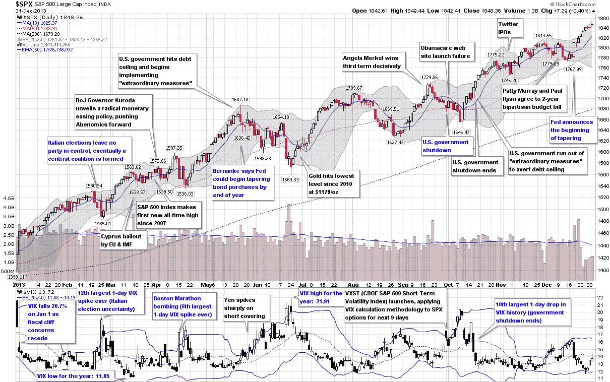

<!--yml
category: 未分类
date: 2024-05-18 16:11:43
-->

# VIX and More: The Year in VIX and Volatility (2013)

> 来源：[http://vixandmore.blogspot.com/2014/01/the-year-in-vix-and-volatility-2013.html#0001-01-01](http://vixandmore.blogspot.com/2014/01/the-year-in-vix-and-volatility-2013.html#0001-01-01)

This is the sixth year in a row I have offered a retrospective look at the year in VIX and Volatility, which is my attempt to cram the highlights of the year in volatility onto one graphic with a manageable amount of annotations.

In terms of equity volatility and specifically the VIX, 2013 was the story of a persistent bull market in stocks and very little in the way of implied or realized volatility, at least by historical standards. In fact, the VIX’s high water mark of 21.91 was the second lowest annual high point since 1995, eclipsed only by the Greenspan liquidity flood in 2005\. Similarly, the average VIX in 2013 was just 14.23, considerably lower than the long-term average, which is a shade over 20\. The year only saw two days in which the SPX was up 2% or more and another two days in which the SPX was down at least 2%, the fewest number of such days since 2006.

Even though the numbers may not be impressive, there were still some significant events during the course of the year that were able to provoke substantial anxiety and [fear](http://vixandmore.blogspot.com/search/label/fear), at least for the short-term. The year began with the [Fiscal Cliff](http://vixandmore.blogspot.com/search/label/fiscal%20cliff) drama coming to an end and saw fear in the euro zone heat up after the [Italian](http://vixandmore.blogspot.com/search/label/Italy) elections ended with a parliamentary deadlock and Cypriot banks triggered a joint EU/IMF bailout of Cyprus. The Boston Marathon bombings provided a jolt of terrorist fear in April and fears about [Japan](http://vixandmore.blogspot.com/search/label/Japan) the future of Abenomics created huge volatility in the [yen](http://vixandmore.blogspot.com/search/label/Yen), with ripple effects felt across currency markets and in many related financial markets during May and June.

In the U.S., the Fed tapering scenarios dominated the investment landscape during the second half of the year and the [debt ceiling](http://vixandmore.blogspot.com/search/label/debt%20ceiling) crisis, government shutdown and entrenched bipartisan bickering cast many doubts about the potential for some huge self-inflicted wounds.

In the end, the SPX set 44 new all-time closing highs in 2013 and the VIX ended the year almost 24% below where it finished in 2012, though the Fiscal Cliff was responsible for most of that gap.

*[source(s): StockCharts.com. VIX and More]*

So far 2014 looks more interesting from a volatility perspective, but the year is young and the volatility story is always one of surprises in the form of swans with dark gray plumage.

Related posts:

***Disclosure(s):*** *none*