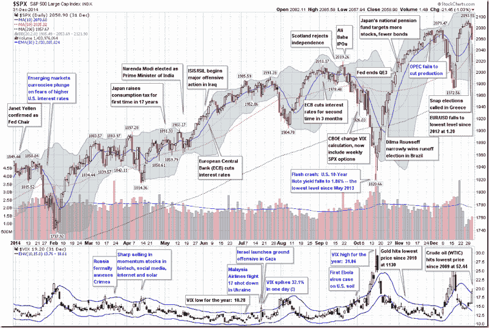

<!--yml
category: 未分类
date: 2024-05-18 16:09:39
-->

# VIX and More: The Year in VIX and Volatility (2014)

> 来源：[http://vixandmore.blogspot.com/2015/01/the-year-in-vix-and-volatility-2014.html#0001-01-01](http://vixandmore.blogspot.com/2015/01/the-year-in-vix-and-volatility-2014.html#0001-01-01)

This is the seventh year in a row I have offered a retrospective look at the year in VIX and Volatility, which is my attempt to cram some of the highlights of the year in volatility onto one ~~eye chart~~ graphic with a (somewhat) manageable number of annotations.

In aggregate, 2014 was a very quiet year for the VIX, with a mean close of just 14.19 for the year, which is the lowest the VIX has been since 2006 and third lowest since 1995\. On the other hand, as I recently documented, [VIX spikes](http://vixandmore.blogspot.com/search/label/VIX%20spikes) were common last year, with 2014 registering the [third highest number of 20% VIX spikes](http://vixandmore.blogspot.com/2015/01/2014-had-third-highest-number-of-20-vix.html) since the beginning of VIX data, in 1990\. In short, the VIX was susceptible to large spikes, but these were typically followed by strong [mean-reverting](http://vixandmore.blogspot.com/search/label/mean%20reversion) declines. For example, the peak VIX of 31.06 on October 15 was the highest VIX reading since 2011, yet just six weeks later the VIX was back in the 11s.

When asked in October what they perceived as the biggest threat to stocks, respondents to the *VIX and More* fear poll pointed to the end of quantitative easing and the removal of the Fed safety net as their top concern, with [Ebola](http://vixandmore.blogspot.com/search/label/Ebola) narrowly edging out the much more nebulous “market technical factors” for the second slot. As best as I am able to determine, it was the panic associated with [fears](http://vixandmore.blogspot.com/search/label/fear) of an Ebola epidemic that took an already elevated VIX and pushed it up into the 30s.

At various times during the year, [Ukraine](http://vixandmore.blogspot.com/search/label/Ukraine)/[Russia](http://vixandmore.blogspot.com/search/label/Russia), [crude oil](http://vixandmore.blogspot.com/search/label/crude%20oil), ISIS/ISIL, [Israel](http://vixandmore.blogspot.com/search/label/Israel)/Gaza, [the Fed](http://vixandmore.blogspot.com/search/label/FOMC) and the European Central Bank all managed to increase anxiety and perceptions of risk among investors. Also, the narrow miss in the vote for Scottish independence created turmoil in the United Kingdom and across the euro zone, but managed to avoid morphing into another nationalist crisis. Early in the year, there was a [currency](http://vixandmore.blogspot.com/search/label/currencies) crisis in [emerging markets](http://vixandmore.blogspot.com/search/label/emerging%20markets) that was triggered by (unfounded, in retrospect) concerns about higher interest rates in the U.S. Throughout the year there were concerns about valuations and excesses momentum trading in the likes of [biotechnology](http://vixandmore.blogspot.com/search/label/biotech), social media, internet and solar stocks. To some extent, these concerns peaked in April (see [The Correction as Seen in the ETP Landscape](http://vixandmore.blogspot.com/2014/04/the-correction-as-seen-in-etp-landscape.html) for additional details), only to return periodically throughout the balance of the year.

**

*[source(s): StockCharts.com, VIX and More]*

Last year at this time, the prevailing worries were focused on whether or not Fed Chair Janet Yellen was leaning toward a more hawkish stance, the inevitable march to higher interest rates in the U.S., the weakening of emerging markets currencies and the potential fallout from the Fed’s tapering of bond purchases. In retrospect, investors were largely worrying about the wrong things.

The first few weeks of 2015 have seen [Greece](http://vixandmore.blogspot.com/search/label/Greece), Saudi Arabia and Ukraine back in the spotlight, with the Swiss National Bank and European Central Bank dominating news on the central banking front. If the past is any guide, the big issue for 2015 has yet to rear its ugly head, whether it turns out to be a gray, charcoal or black swan.

Related posts:

***Disclosure(s):*** *none*