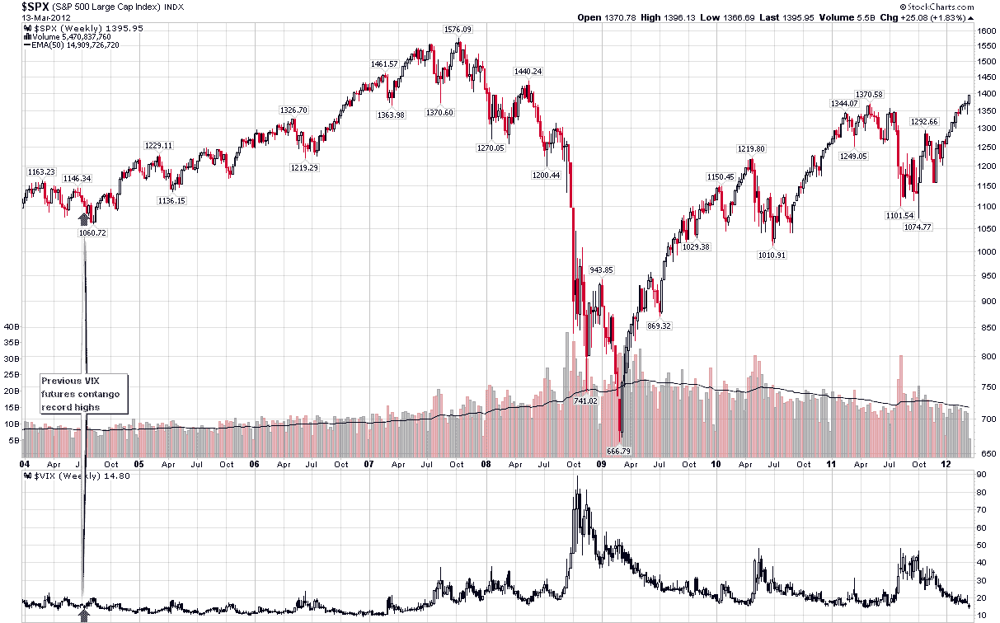

<!--yml
category: 未分类
date: 2024-05-18 16:35:54
-->

# VIX and More: Third Steepest First-Second Month VIX Futures Contango Ever

> 来源：[http://vixandmore.blogspot.com/2012/03/third-steepest-first-second-vix-futures.html#0001-01-01](http://vixandmore.blogspot.com/2012/03/third-steepest-first-second-vix-futures.html#0001-01-01)

For a variety of reasons, investors seem unwilling to embrace the current rally and with each day the market rises, I see a scramble in the indicator forest to find some sort of proof that stocks are finally, inevitably going to correct…and soon. I need to give this phenomenon a name, so I am going to call it [indicator hunting](http://vixandmore.blogspot.com/search/label/indicator%20hunting) and define it as a companion to [confirmation bias](http://vixandmore.blogspot.com/search/label/confirmation%20bias).

I discussed this subject a little over a month ago in [What the VIX Kitchen Sink Chart Says](http://vixandmore.blogspot.com/2012/02/what-vix-kitchen-sink-chart-says.html) (it hasn’t said much lately, but I’m trying to teach it sign language), when I noted:

> *“One of the more interesting developments of 2012 has been to watch the diminution of the strident bearish narrative that has been focused largely on the collision course between a preponderance of debt and low or negative growth. The bullish beginning to 2012, however, has not prompted many in the way of converts to the bullish camp. Instead, there have been whispers of ‘…overbought…’ that have turned into a soft murmur and are now verging on becoming loud chorus. Suddenly the general consensus seems to be that stocks just do not deserve their current lofty valuation.*

 *> *In this type of environment, many investors become particularly susceptible to [confirmation bias](http://vixandmore.blogspot.com/search/label/confirmation%20bias) and scramble to find one or more indicators which will tell them what they have already begun to believe: that a major correction is likely just around the corner.”*

Not surprisingly, the clamoring has only become more strident as stocks have continued to rise.

One of the current targets of indicator hunting is the huge [contango](http://vixandmore.blogspot.com/search/label/contango) in the [VIX futures](http://vixandmore.blogspot.com/search/label/VIX%20futures) [term structure](http://vixandmore.blogspot.com/search/label/term%20structure). Some are saying it is steeper than it has ever been before (it isn’t) and others are convinced that this means the presumably omniscient SPX options traders are foretelling something between a steep selloff and a market crash just around the corner.

While selling fear is a proven media strategy and sometimes an attractive investment strategy, I submit that these pundits are giving SPX options traders too much credit and are substantially off the mark in their analysis.

In next week’s issue of [*Expiring Monthly: The Option Traders Journal*](http://www.expiringmonthly.com/), I analyze the VIX term structure as a predictor of future changes in stocks and volatility. Let’s just say that, at a minimum, that these same pundits are going to be surprised by the results.

To illustrate my point, consider that yesterday’s close marked the third steepest contango reading for the first and second month VIX futures. The chart below highlights the first and second steepest (front month and second month) VIX futures contango readings on record, which date back to July 2004, some 3 ½ months after the CBOE launched VIX futures. Looking at the chart, those two consecutive days appear almost to have been selected at random, coming at a time in which the SPX was 3.5% below a high from two weeks earlier and four weeks prior to a cycle low that would see the SPX decline another 4.2%. In the bigger picture, however, the record VIX futures contango came at a time when stocks were taking a breather before embarking on another huge bull leg. Ironically, the VIX was also hovering at about 15.00 when the VIX futures contango established the record, but five months later it would be trading in the 11s and one year later we even saw a [sub-10](http://vixandmore.blogspot.com/search/label/sub-10) VIX.

Now I would be foolish to rule out the possibility of another [sharp pullback](http://vixandmore.blogspot.com/2012/03/putting-current-26-spx-pullback-in.html), but I think it is even more foolish to stubbornly stick to preconceived notions, ignore the market action and confirmation bias and indicator hunting (perhaps even [availability bias](http://vixandmore.blogspot.com/search/label/availability%20bias) and [disaster imprinting](http://vixandmore.blogspot.com/search/label/disaster%20imprinting) as well) drag down your portfolio.

Related posts:

**

*[source(s): StockCharts.com]*

***Disclosure(s):*** *the CBOE is an advertiser on VIX and More**