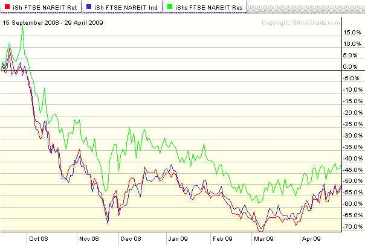

<!--yml
category: 未分类
date: 2024-05-18 17:49:56
-->

# VIX and More: Three Commercial Real Estate Sub-Sector ETFs to Watch

> 来源：[http://vixandmore.blogspot.com/2009/04/three-commercial-real-estate-sub-sector.html#0001-01-01](http://vixandmore.blogspot.com/2009/04/three-commercial-real-estate-sub-sector.html#0001-01-01)

I plead guilty to treating [commercial real estate](http://vixandmore.blogspot.com/search/label/commercial%20real%20estate) as a single homogeneous entity in my two previous commercial real estate posts, [Commercial Real Estate Problems Piling Up](http://vixandmore.blogspot.com/2009/04/commercial-real-estate-problems-piling.html) and [Moodys/REAL Commercial Property Price Index](http://vixandmore.blogspot.com/2009/04/moodysreal-commercial-property-price.html).

The truth is that while there are a wide variety of [REITs](http://vixandmore.blogspot.com/search/label/REITs) out there that span the full range of commercial real estate activity, my focus is mainly on ETFs and when it comes to ETFs, most of the popular real estate ETFs are of the large catchall variety, such as [IYR](http://vixandmore.blogspot.com/search/label/IYR), [ICF](http://vixandmore.blogspot.com/search/label/ICF), [VNQ](http://vixandmore.blogspot.com/search/label/VNQ) and [RWR](http://vixandmore.blogspot.com/search/label/RWR).

While I am not aware of any ETFs that are pure plays on shopping center REITs, office REITs or apartment REITs, there are three commercial real estate sub-sector REIT ETFs that can help sort through various sectoral trends within the REIT universe. The three sub-sector ETFs, with their allocations as of April 28^(th) are as follows:

[FTSE NAREIT Retail Capped Index Fund](http://us.ishares.com/product_info/fund/overview/RTL.htm) ([RTL](http://vixandmore.blogspot.com/search/label/RTL))

*   52.28% Equity Shopping Centers
*   35.85% Equity Regional Malls
*   11.47% Equity Free Standing
*   0.20% Short-Term Securities

[FTSE NAREIT Industrial/Office Capped Index Fund](http://us.ishares.com/product_info/fund/overview/FIO.htm) ([FIO](http://vixandmore.blogspot.com/search/label/FIO))

*   54.87% Equity Office
*   26.92% Equity Industrial
*   17.93% Equity Mixed

[FTSE NAREIT Residential Plus Capped Index Fund](http://us.ishares.com/product_info/fund/overview/REZ.htm) ([REZ](http://vixandmore.blogspot.com/search/label/REZ))

*   41.98% Equity Apartments
*   39.02% Equity Health Care
*   15.35% Equity Self Storage
*   3.37% Equity Manufactured Homes
*   0.07% Short-Term Securities

For the record, the limited liquidity for RTL and FIO makes them better indicators than trading vehicles, but REZ is actively traded.

As the chart below shows, the retail and industrial/office REIT ETFs have moved almost in lockstep in the post-Lehman world, while the residential ETF fared better in the downturn, but has been a little more sluggish during the bounce off of the March bottom.

*[source: StockCharts.com]*