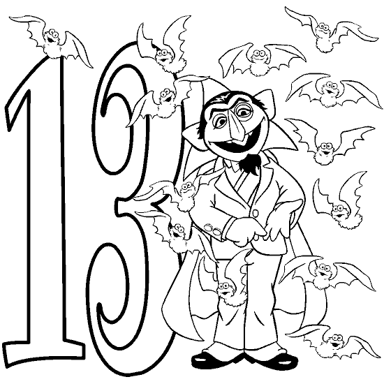

<!--yml
category: 未分类
date: 2024-05-18 19:11:01
-->

# VIX and More: Three Out of Four, Unlucky or More

> 来源：[http://vixandmore.blogspot.com/2007/06/three-out-of-four-unlucky-or-more.html#0001-01-01](http://vixandmore.blogspot.com/2007/06/three-out-of-four-unlucky-or-more.html#0001-01-01)

You will have to excuse me for using a title that sounds like a nursery rhyme, but one of the things that I discovered during the [Trivial Pursuit](http://www.trivialpursuit.com/) fad years was that my childhood was seriously deficient in nursery rhymes.

Fortunately, the condition is relatively benign, but it has been know to manifest itself in my adult life via the occasional lapse into [Seuss](http://en.wikipedia.org/wiki/Dr._Seuss) meter and some silly sounding blog post titles…

But enough about me; volatility is the real star here.

How volatile has volatility been lately?

That’s never an easy question to answer, but with Excel

[Ginsu](http://en.wikipedia.org/wiki/Ginsu)

, I am always able to come up with at least two or three different answers. Try this one on for size: three out of the past four days have seen changes in the VIX of 13% or more…and this has only happened two other times in the last 15 years. You probably know those other two instances well: February 27 – March 2, 2007 and June 12 – 16, 2006\. Each of these instances fell just prior to an important bottom.

Does this mean a bottom is just around the corner? Hardly…but I crunched some more numbers just to be on the safe side. It turns out that these three days out of four volatility clusters are generally associated with intermediate market bottoms and not market topping action. So while this action may look toppy to some, historically it is much more bullish than bearish.

Of course, now I am left to ponder how to best identify a toppy market through the eyes of the VIX. My hunch is that

[Bollinger band width](http://vixandmore.blogspot.com/search/label/Bollinger%20band%20width)

may be a key here, but I’ll give this one some more thought and report back when I have something of interest to say.