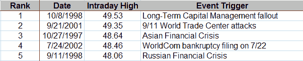

<!--yml
category: 未分类
date: 2024-05-18 18:24:37
-->

# VIX and More: Top Five VIX Spikes

> 来源：[http://vixandmore.blogspot.com/2008/09/top-five-vix-spikes.html#0001-01-01](http://vixandmore.blogspot.com/2008/09/top-five-vix-spikes.html#0001-01-01)

With the [VIX spiking](http://vixandmore.blogspot.com/search/label/VIX%20spikes) up to 39.59 just a moment ago, I thought it might be instructive to recap the top five VIX readings since 1990, the first year for which the CBOE has calculated VIX historical data:

Note that these readings are all dwarfed by the [high of over 170](http://vixandmore.blogspot.com/2008/03/volatility-history-lesson-1987.html) recorded by the [VXO](http://vixandmore.blogspot.com/search/label/VXO) (‘old VIX’) on [Black Monday](http://vixandmore.blogspot.com/search/label/Black%20Monday) [1987](http://vixandmore.blogspot.com/search/label/1987).