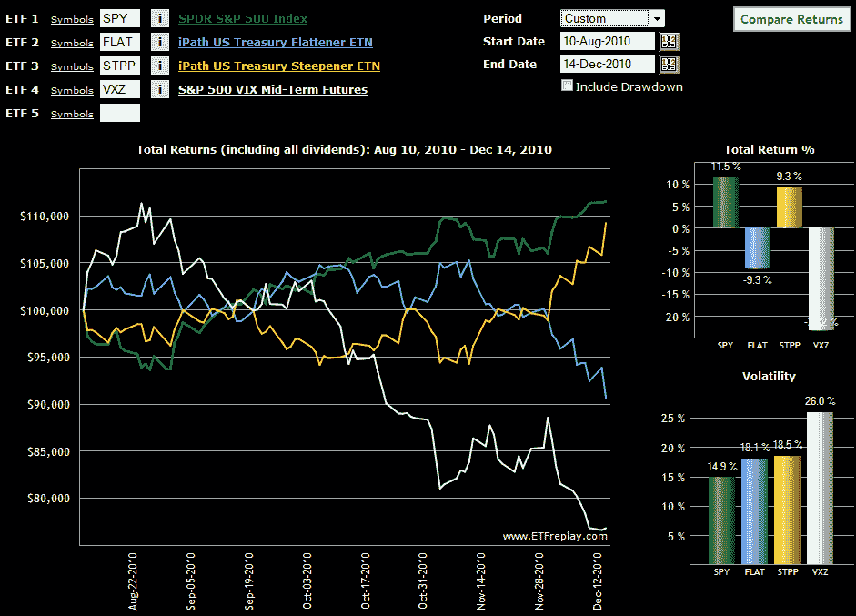

<!--yml
category: 未分类
date: 2024-05-18 16:56:29
-->

# VIX and More: Treasury Yield Curve ETNs and Volatility

> 来源：[http://vixandmore.blogspot.com/2010/12/treasury-yield-curve-etfs-and.html#0001-01-01](http://vixandmore.blogspot.com/2010/12/treasury-yield-curve-etfs-and.html#0001-01-01)

The subject of the VIX and Treasury yields is one I have probably not explored in sufficient detail in this space, so with some recent developments, this seems like a good time to dive into that subject.

One big reason for my interest is the recent rapid steepening of the Treasury [yield curve](http://vixandmore.blogspot.com/search/label/yield%20curve). Another is an excellent article on two yield curve ETN plays from Timothy Strauts of Morningstar: [How to Take Advantage of a Steep Yield Curve](http://advisor.morningstar.com/articles/fcarticle.asp?docId=20710&sPage=1). In the article, Strauts discusses two ETNs from iPath that are designed to take advantage of a yield curve that becomes steeper or flatter. The ETNs are known formally as the iPath US Treasury Steepener ETN ([STPP](http://vixandmore.blogspot.com/search/label/STPP)) and the iPath US Treasury Flattener ETN ([FLAT](http://vixandmore.blogspot.com/search/label/FLAT)). These innovative and exciting ETNs hold 2-year and 10-year Treasury futures and are rebalanced monthly. In many respects they represent the latest generation of what I refer to as [strategy-in-a-box ETPs](http://vixandmore.blogspot.com/search/label/Strategy-in-a-Box%20ETFs).

Launched in August, STPP and FLAT have started to attract some attention in the last few weeks, as Treasury yields have become more volatile.

There is not yet much of a track record, but I will be interested to see how the movements in STPP and FLAT interact with movements in the VIX. For an initial pass, I have chosen to look at STPP and FLAT in conjunction with SPY and [VXZ](http://vixandmore.blogspot.com/search/label/VXZ). (Note that I chose VXZ here in order to sidestep the strong [contango](http://vixandmore.blogspot.com/search/label/contango) in the [VIX futures](http://vixandmore.blogspot.com/search/label/VIX%20futures) [term structure](http://vixandmore.blogspot.com/search/label/term%20structure) that exacerbated the price decline in [VXX](http://vixandmore.blogspot.com/search/label/VXX) as of late.)

The chart below shows the performance of the yield curve ETNs since their August 10^(th) launch. Note that so far – and particularly as of late – it has been FLAT which has been more positively correlated with changes in implied volatility expectations as measured by VXZ. On the flip side, STPP has demonstrated a higher positive correlation with stocks, at least as reflected in SPY.

Going forward, I will provide periodic updates on my observations between changes in the Treasury yield curve in the VIX and also take up the subject of how the Treasury yield curve might be able to predict the future of the VIX.

Related posts:

*[source: ETFreplay.com]*

 ***Disclosure(s):*** *short VXX at time of writing*