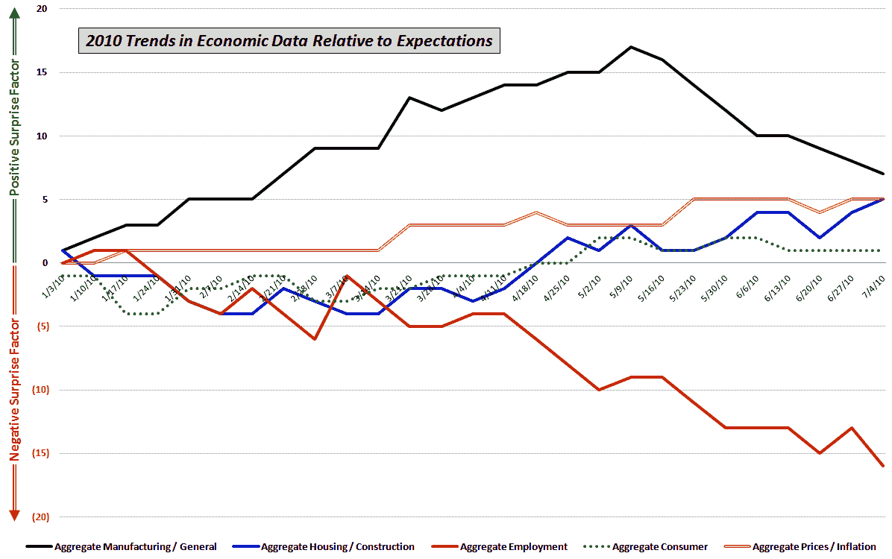

<!--yml
category: 未分类
date: 2024-05-18 17:06:54
-->

# VIX and More: Trends in Economic Data Relative to Expectations

> 来源：[http://vixandmore.blogspot.com/2010/07/trends-in-economic-data-relative-to.html#0001-01-01](http://vixandmore.blogspot.com/2010/07/trends-in-economic-data-relative-to.html#0001-01-01)

Before the long weekend, I thought I would post a chart I use in which I track the performance of key economic data releases relative to consensus expectations.

The data are sorted into five groups and include economic reports such as the ones highlighted below:

*   *Manufacturing/General* – GDP, ISM, Industrial Production, Capacity Utilization, Durable Goods, Factory Orders, Regional Fed Indices, Productivity, etc.
*   *[Housing](http://vixandmore.blogspot.com/search/label/housing)/Construction* – Building Permits, Housing Starts, Existing Home Sales, New Home Sales, Pending Home Sales, S&P/Case-Shiller Home Prices, Construction Spending, etc.
*   *[Employment](http://vixandmore.blogspot.com/search/label/nonfarm%20payrolls)* – Employment Report, Jobless Claims, etc.
*   *Consumer* – Retail Sales, Consumer Confidence, Consumer Sentiment, Personal Income, Personal Spending, etc.
*   *Prices/Inflation* – Producer Price Index, Consumer Price Index, etc.

For each report, I evaluate whether the data exceeds or falls short of consensus expectations. I then aggregate the data over time to see the extent to which certain segments of the economy are trending higher or lower relative to expectations.

The chart below summarizes the trends in these five categories since the beginning of the year. In terms of performance relative to expectations, manufacturing (solid black line) has performed best, though the trend has turned down for the last two months or so. Not surprisingly, the worst performing area – by a considerable margin – has been employment (solid red line), where the trend relative to expectations has been consistently negative since the middle of April.

For more on related subjects, readers are encouraged to check out:

***Disclosure(s):*** *none*