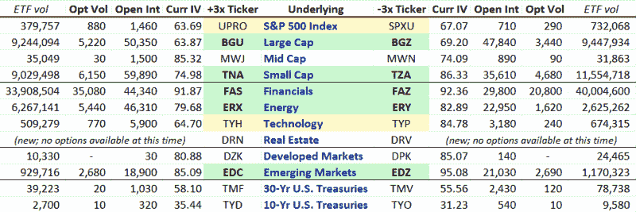

<!--yml
category: 未分类
date: 2024-05-18 17:37:47
-->

# VIX and More: Triple ETF Options Landscape

> 来源：[http://vixandmore.blogspot.com/2009/07/triple-etf-options-landscape.html#0001-01-01](http://vixandmore.blogspot.com/2009/07/triple-etf-options-landscape.html#0001-01-01)

Since I find myself increasingly active in trading options in [triple ETFs](http://vixandmore.blogspot.com/search/label/triple%20ETFs), I thought readers might find it interesting to see a graphic of some important options data on the triple ETFs currently in the market.

Utilizing data from [iVolatility.com](http://www.ivolatility.com/options.j), the spreadsheet below captures the average options volume, open interest and current implied volatility for the 12 pairs of triple ETFs. I have separated the ETFs into four groups: broad index ETFs (market cap focus); sector ETFs; geography ETFs; and bond ETFs. I have also color coded the top five pairs in terms of liquidity in green, with two additional pairs highlighted in yellow that I believe are liquid enough to trade, though they do not yet have the following of the “big five.”

I will refrain from additional comments, other than to note that I believe a lot of additional information of interest can be gleaned from this relatively simple graphic.

For a related post, see: [Using Options to Control Risk in Leveraged ETFs](http://vixandmore.blogspot.com/2009/05/using-options-to-control-risks-in.html)

*[source: iVolatility]*