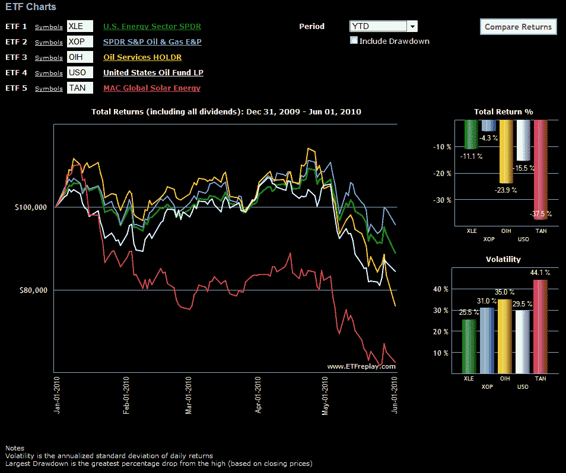

<!--yml
category: 未分类
date: 2024-05-18 17:09:10
-->

# VIX and More: Turmoil in the Oil Patch

> 来源：[http://vixandmore.blogspot.com/2010/06/turmoil-in-oil-patch.html#0001-01-01](http://vixandmore.blogspot.com/2010/06/turmoil-in-oil-patch.html#0001-01-01)

Several factors have combined to create turmoil in the oil patch. Most notably, the Deepwater Horizon oil spill has hammered the stocks of [BP](http://vixandmore.blogspot.com/search/label/BP) and Transocean ([RIG](http://vixandmore.blogspot.com/search/label/RIG)), while tainting the entire oil and oil services ([OIH](http://vixandmore.blogspot.com/search/label/OIH), [XES](http://vixandmore.blogspot.com/search/label/OIH)) sector. On top of the spill, the European sovereign debt crisis has generated concerns about an economic slowdown of the European region and beyond, while manufacturing data and other news out of China hints at the possibility of weakness in the most significant area for future growth in energy demand.
In short, valuations across the sector are way down and yet the long-term supply and demand imbalance will likely suffer no more than a small dent as a result of the events of the last couple of months.
The energy sector has a very promising future and I am looking to add to existing positions on weakness. As the chart below shows, there are some indications that [crude oil](http://vixandmore.blogspot.com/search/label/crude%20oil) ([USO](http://vixandmore.blogspot.com/search/label/USO)) may have put in a bottom and the exploration and production ETF ([XOP](http://vixandmore.blogspot.com/search/label/XOP)) may also be beginning a bottoming process as well. Outside of fossil fuels, alternative energy plays in [solar](http://vixandmore.blogspot.com/search/label/solar%20stocks) ([TAN](http://vixandmore.blogspot.com/search/label/TAN), [KWT](http://vixandmore.blogspot.com/search/label/KWT)) and wind ([FAN](http://vixandmore.blogspot.com/search/label/FAN), [PWND](http://vixandmore.blogspot.com/search/label/PWND)) are somewhat suspect in that critical governmental subsidies from the likes of Spain and Germany appear to be a victim of the sovereign debt crisis. Still, these alternative energy plays, including some broad-based alternative energy ETFs ([GEX](http://vixandmore.blogspot.com/search/label/GEX), [PBD](http://vixandmore.blogspot.com/search/label/PBD)), have also been marked down dramatically and should also benefit as crude oil prices start to rebound and governments come under increasing pressure to make use of ecologically sustainable energy sources.
For more on related subjects, readers are encouraged to check out:

*[source: ETFreplay.com]*

***Disclosure(s):*** *long OIH and XOP at time of writing*