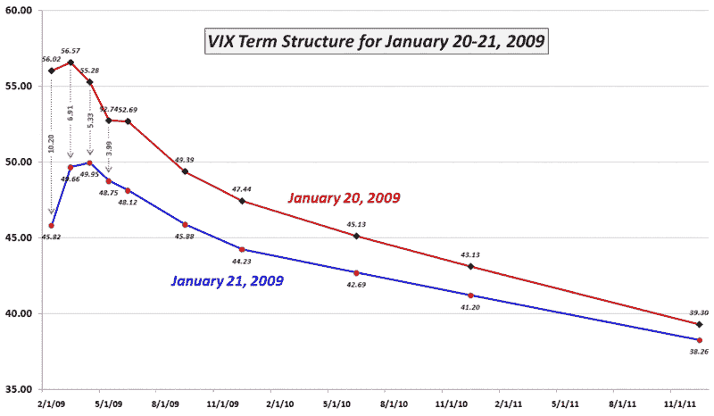

<!--yml
category: 未分类
date: 2024-05-18 18:04:18
-->

# VIX and More: Twenty Four Hours in the Life of the VIX Term Structure

> 来源：[http://vixandmore.blogspot.com/2009/01/twenty-four-hours-in-life-of-vix-term.html#0001-01-01](http://vixandmore.blogspot.com/2009/01/twenty-four-hours-in-life-of-vix-term.html#0001-01-01)

When I [last checked in](http://vixandmore.blogspot.com/2008/12/vix-term-structure-chances-since.html) on the VIX term structure, I used a graphic to show the changes in the [term structure](http://vixandmore.blogspot.com/search/label/term%20structure) from the VIX peak on November 20^(th) to the more complacent December 12^(th) values. The results were dramatic and showed a drop of over 31 points in the front month volatility with the change falling off to just under 3 for the June 2010 SPX options.

Today I want to show what can happen in just 24 hours. Of course these were not your typical 24 hours, they were the first time the VIX has logged consecutive point changes of 10.00 or more: Tuesday the VIX gained 10.54; and yesterday the VIX lost 10.23 points.

The volatility dislocations resulting from yesterday’s market rally pushed the entire term structure down once again. In the chart below, I have highlighted the changes in [implied volatility](http://vixandmore.blogspot.com/search/label/implied%20volatility) for SPX options for the first four months of the term structure. The one day change in February was 10.20 – almost the same as the drop in the cash/spot VIX. Looking out to March, implied volatility dropped 6.91\. In April the drop was 5.33 and for May, IV dropped only 3.99\. The smallest change was in the most distant month, December 2011, where implied volatility dropped only 1.04.

Even as volatility expectations have decreased in the last 24 hours, note that expectations for SPX IV for the end of the year are still in the area of 44 and do not drop below 40 until the middle of 2011\. Volatility may be coming out of the markets, but according to options traders, the process will be a long and slow one.

*[source: CBOE, VIX and More]*