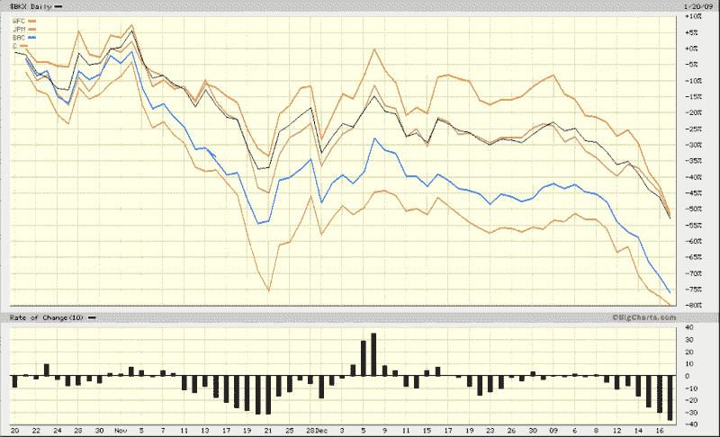

<!--yml
category: 未分类
date: 2024-05-18 18:04:58
-->

# VIX and More: U.S. Banking Index More Bearish than November

> 来源：[http://vixandmore.blogspot.com/2009/01/us-banking-index-more-bearish-than.html#0001-01-01](http://vixandmore.blogspot.com/2009/01/us-banking-index-more-bearish-than.html#0001-01-01)

With pressure on banks increasing across the globe and hitting European banks ([RBS](http://vixandmore.blogspot.com/search/label/RBS), [AIB](http://vixandmore.blogspot.com/search/label/AIB), [BCS](http://vixandmore.blogspot.com/search/label/BCS) and [DB](http://vixandmore.blogspot.com/search/label/DB)) particularly hard, the U.S. banking sector now finds itself falling faster than it did even at the November lows. State Street Corp. ([STT](http://vixandmore.blogspot.com/search/label/STT)) has been considered one of the safest U.S. banks, yet announced today that profits in the most recent quarter fell 71%, largely as a result of a [$6.3 billion loss in its investment portfolio](http://biz.yahoo.com/rb/090120/business_us_statestreet.html?.v=4) during the quarter.

The chart below shows that the selloff in the banking index ([BKX](http://vixandmore.blogspot.com/search/label/BKX)) is sharper now than it was at any time during the November bank panic. While the banking index and most of the large banks are making new lows, the S&P 500 index has managed to [draw strength from other sectors](http://vixandmore.blogspot.com/2009/01/financials-account-for-half-of-loss-in.html) to remain above the November lows and even above last week’s low.

The rest of the week should determine whether we have a higher low in the broader indices (my guess) or break below SPX 800 to challenge the November lows.

*[source: BigCharts]*