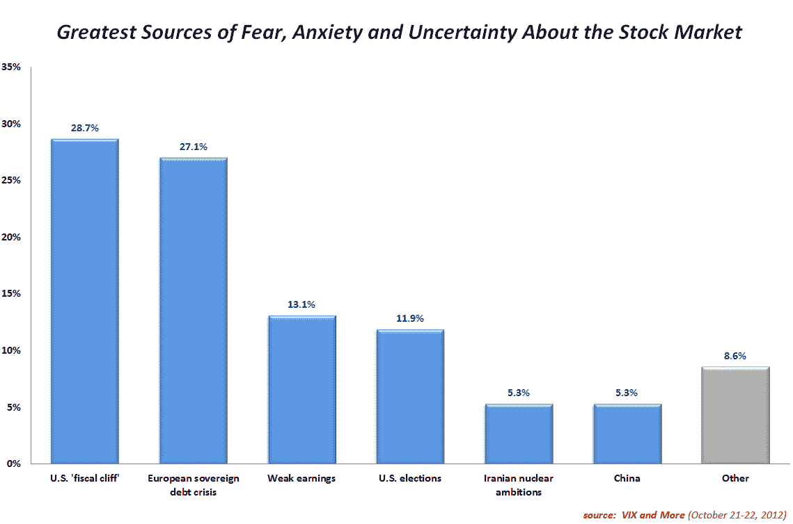

<!--yml
category: 未分类
date: 2024-05-18 16:24:30
-->

# VIX and More: U.S. Fiscal Cliff Concerns Top Results in Inaugural VIX and More Fear Poll

> 来源：[http://vixandmore.blogspot.com/2012/10/us-fiscal-cliff-concerns-top-results-in.html#0001-01-01](http://vixandmore.blogspot.com/2012/10/us-fiscal-cliff-concerns-top-results-in.html#0001-01-01)

Today I closed the books on the first *[VIX and More Fear Poll](http://vixandmore.blogspot.com/search/label/Fear%20poll)*, which I consider to be an unqualified success and a first step in establishing longitudinal data about the types of geopolitical, macroeconomic, technical and other issues that make investors fearful, anxious and uncertain about the future of the stock market.

In a battle that went down to the wire, 28.7% investors voted the [U.S. fiscal cliff](http://vixandmore.blogspot.com/search/label/fiscal%20cliff) as their #1 concern right now, followed closely by [fears](http://vixandmore.blogspot.com/search/label/fear) about the [European sovereign debt crisis](http://vixandmore.blogspot.com/search/label/European%20sovereign%20debt%20crisis), which 27.1% labeled as their top issue. The prospect of a weak earnings season was a distant third at 13.1%.

*[source(s): VIX and More]*

There were some interesting findings when the 244 responses were broken out geographically. In the U.S., for instance, the fiscal cliff issue dominated the European sovereign debt crisis, 31.5% to 22.2%, with weak earnings third at 15.4%. Looking at non-U.S. responses, the Americentric bias disappears, as 36.6% of respondents tab the European sovereign debt crisis as their top worry, followed by the fiscal cliff (23.2%) and U.S. elections (9.8%).

While there were quite a few write-in votes, no theme emerged from these responses, though central bank interventions, U.S. debt, deleveraging, higher interest rates, high-frequency trading, demographics and technical factors were among the issues cited.

Among some of the questions raised by the results are the role of local and national media in shaping investors’ fears and the tendency of investors to overemphasize events that are closest to home. These are just two of the issues that I hope to explore going forward, making use of some of the data generated by this poll over time and comparing the ebb and flow of concerns against the ebb and flow of the VIX.

Going forward, I anticipate a weekly *VIX and More* Fear Poll each weekend, with the results and some takeaways to be published at about the same time every week.

Related posts:

***Disclosure(s):*** *none*