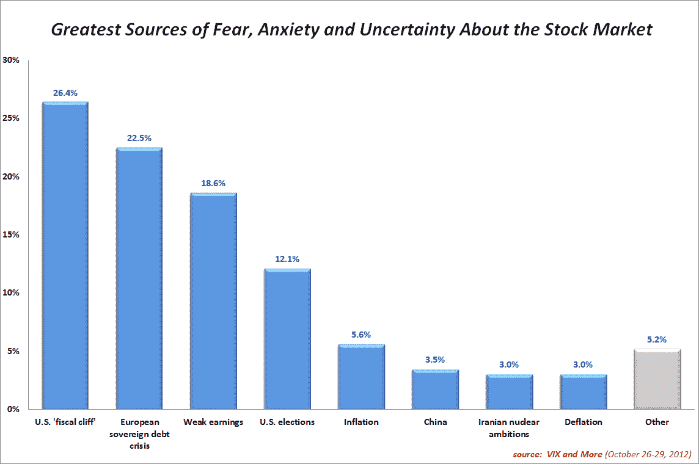
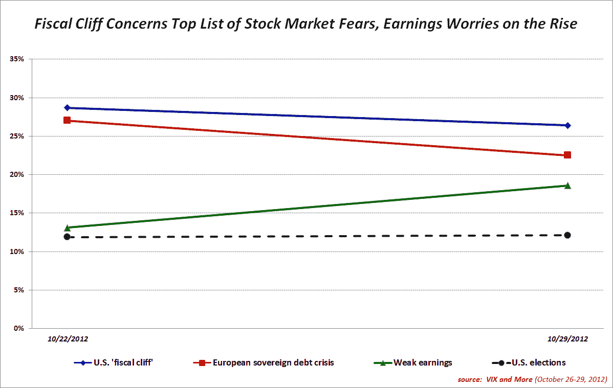

<!--yml
category: 未分类
date: 2024-05-18 16:24:20
-->

# VIX and More: U.S. Fiscal Cliff Fears Top VIX and More Fear Poll Again

> 来源：[http://vixandmore.blogspot.com/2012/10/us-fiscal-cliff-fears-top-vix-and-more.html#0001-01-01](http://vixandmore.blogspot.com/2012/10/us-fiscal-cliff-fears-top-vix-and-more.html#0001-01-01)

For the second week in a row, investors cited the [U.S. fiscal cliff](http://vixandmore.blogspot.com/search/label/fiscal%20cliff) as the top risk to the stock market, followed closely by [fears](http://vixandmore.blogspot.com/search/label/fear) about the [European sovereign debt crisis](http://vixandmore.blogspot.com/search/label/European%20sovereign%20debt%20crisis). Concerns about weak earnings, a distant third last week, gained significant ground as Apple ([AAPL](http://vixandmore.blogspot.com/search/label/AAPL)) and others continued to report disappointing earnings and revenues while guiding future expectations lower.

As was the case last week, geography appears to have a significant influence on results, with a clear Americentric bias coming from U.S.-based respondents. In the U.S., for instance, concerns about the fiscal cliff outpolled the European sovereign debt crisis by 9.5%, but outside of the U.S. the European sovereign debt crisis topped concerns about the fiscal cliff by 8.2%. Similarly, 15.2% of U.S. respondents cited U.S. election uncertainty as the biggest risk to stocks while just 5.5% of non-U.S. respondents judged U.S. elections to be the top risk factor.

This week I added inflation and deflation to the list of pre-populated answers. Both responses fell far down the list of concerns, but almost twice as many respondents expressed concern about inflation relative to deflation.  While the graphic below shows the week-to-week changes in the top four issues driving stock market fears, it will probably be several more weeks before this graphic offers meaningful insights.

Once again, there were quite a few write-in votes, but there was no discernible theme among write-in responses.

With U.S. stock markets closed today due to hurricane Sandy, the VIX currently stands at 17.81, some 7.2% higher than it was a week ago when I published the [results of the inaugural VIX and More Fear Poll](http://vixandmore.blogspot.com/2012/10/us-fiscal-cliff-concerns-top-results-in.html).

Related posts:

***Disclosure(s):*** *long VIX and short AAPL at time of writing*