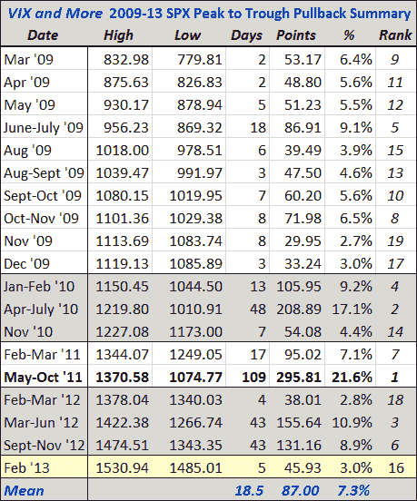

<!--yml
category: 未分类
date: 2024-05-18 16:18:24
-->

# VIX and More: Updated SPX Pullback Summary Table for SPX 1485

> 来源：[http://vixandmore.blogspot.com/2013/02/updated-spx-pullback-summary-table-for.html#0001-01-01](http://vixandmore.blogspot.com/2013/02/updated-spx-pullback-summary-table-for.html#0001-01-01)

One of the graphics that I receive many request for and is my SPX pullback summary table. This table starts with the bottom in the SPX in March 2009 and tracks all meaningful peak-to-trough pullbacks from various new highs in the SPX.

Last week’s new high of SPX 1530.94 and this week’s selling have given me an excuse to update that table with current data – and I have taken the liberty of assuming that the SPX low of 1485.01 from earlier today holds up for now. Using this data, of the 19 pullbacks in the table below, the mean duration is 19 days and the mean pullback is 7.3%. For comparison sake, the medians are considerably lower at 7 days and a 5.6% drawdown.

Extrapolating from these averages, a mean pullback would bring the SPX back to 1420, while a median pullback would suggest a downside target of 1446\. Of course these are just averages; a repeat of the 21.6% pullback from 2011 would put the SPX back exactly at 1200.

*[source(s): Yahoo, VIX and More]*

Related posts:

***Disclosure(s):*** *none*