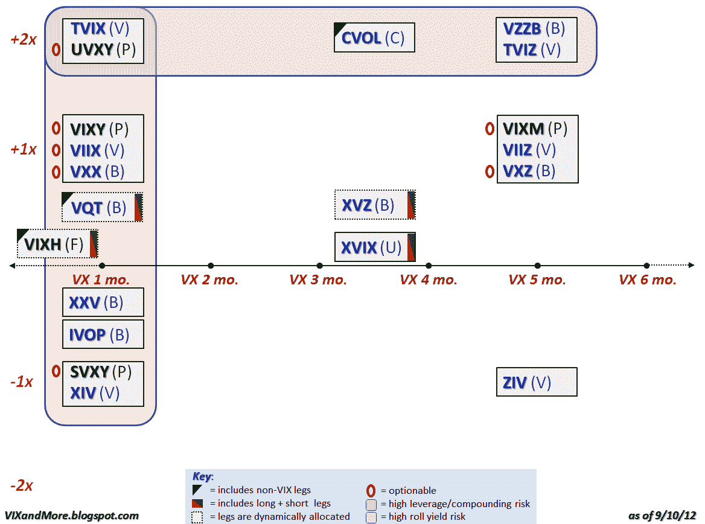

<!--yml
category: 未分类
date: 2024-05-18 16:25:14
-->

# VIX and More: Updates to VIX ETP Landscape: Add VIXH; Drop 12 UBS Products

> 来源：[http://vixandmore.blogspot.com/2012/09/updates-to-vix-etp-landscape-add-vixh.html#0001-01-01](http://vixandmore.blogspot.com/2012/09/updates-to-vix-etp-landscape-add-vixh.html#0001-01-01)

Two thirds of 2012 passed before we saw the first new VIX-based exchange-traded product and it turned out to be an interesting one: [the First Trust CBOE S&P 500 Tail Hedge Fund ETF](http://www.ftportfolios.com/Retail/Etf/EtfSummary.aspx?Ticker=VIXH) ([VIXH](http://vixandmore.blogspot.com/search/label/VIXH)), which was introduced at the end of August. VIXH is essentially a portfolio consisting of 99-100% of SPY, augmented by a dynamic allocation of 0-1% of [VIX options](http://vixandmore.blogspot.com/search/label/VIX%20options), with the amount of options determined by the level of the VIX at the beginning of each VIX expiration cycle. This is the first VIX-based ETP to included VIX options among its holdings and it is notable that this product bucks the recent trend and is an ETF instead of an ETN. There are other features of VIXH worth discussing and I will discuss these in future posts.

As the VIX ETP product space expands a bit, it also contracts a great deal, as UBS has elected to close 12 of its ETRACS ETNs, effective tomorrow, September 11, 2012\. These UBS products failed to gain sufficient volume and assets to make these viable over the long haul, but when [AAVX](http://vixandmore.blogspot.com/search/label/AAVX) retires, it will do so with the best VIX ETP track record of all-time. This product was launched on September 8, 2011 and is up about 120% in the year plus since it was launched. *[See [ETRACS Volatility ETPs](http://vixandmore.blogspot.com/2012/02/etracs-volatility-etps.html) for the full list of ETPs that will be closed.]*

The graphic below is my periodic update of the [VIX exchange-traded products](http://vixandmore.blogspot.com/search/label/VIX%20ETN) (ETP) landscape, using the y-axis to denote leverage and the x-axis to indicate target maturity. In addition to the explanatory notes in the key at the bottom, it is worth noting that I use font color to distinguish between **ETFs** (black) and **ETNs** (blue). Also, I have used a parenthetical one letter code to identify the issuer: B = Barclays; C = Citibank; F = First Trust; P = ProShares; U = UBS; and V = VelocityShares.

*[As an aside, regular posting should resume again this week…]*

Related posts:

******

***Disclosure(s):** long VIX at time of writing*