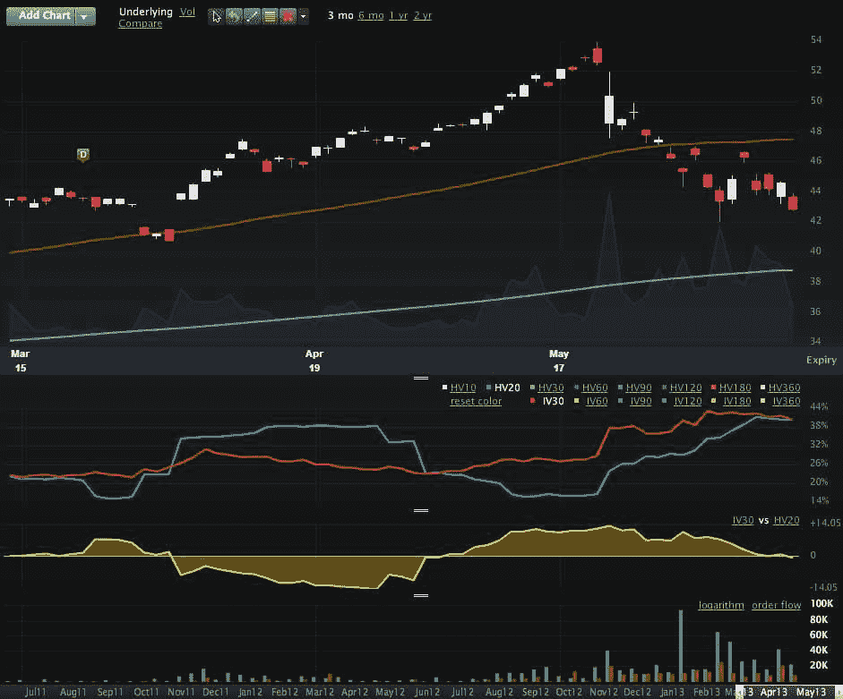

<!--yml
category: 未分类
date: 2024-05-18 16:15:56
-->

# VIX and More: Using DXJ to Monitor Developments in Japanese Equities, Currency and Risk

> 来源：[http://vixandmore.blogspot.com/2013/06/using-dxj-to-monitor-developments-in.html#0001-01-01](http://vixandmore.blogspot.com/2013/06/using-dxj-to-monitor-developments-in.html#0001-01-01)

Since Tuesday’s [The Currency Carry Trade, DBV and Risk](http://vixandmore.blogspot.com/2013/06/the-currency-carry-trade-dbv-and-risk.html) clearly resonated with quite a few investors who are struggling to put their arms around what is going on in [Japan](http://vixandmore.blogspot.com/search/label/Japan) and what the implications are for U.S. equities and other asset classes, I thought I would follow up today by focusing attention on an important ETP that can be used as an indicator or for speculation and hedging: the WisdomTree Japan Hedged Equity Fund ([DXJ](http://vixandmore.blogspot.com/search/label/DXJ)).

As the name suggests, DXJ is designed to be long Japanese equities, with no exposure to fluctuations in the Japanese [yen](http://vixandmore.blogspot.com/search/label/Yen), due to hedging of the currency. As WisdomTree puts it:

“The Fund employs an investment approach designed to track the performance of the WisdomTree Japan Hedged Equity Index. The Index and the Fund are designed to provide exposure to equity securities in Japan, while at the same time hedging exposure to fluctuations between the value of the U.S. dollar and the Japanese yen. The Index and the Fund seek to track the performance of equity securities in Japan that is attributable solely to stock prices without the effect of currency fluctuations.”

While DXJ was launched back on June 16, 2006, it was not until January 15, 2013 that options began trading on this product. The introduction of options is particularly notable in that while DXJ’s price provides an aggregated view of Japanese equities net of currency fluctuations, one can also use the implied volatility data from the options prices to determine how market participants see the risk and uncertainty in currency-hedged Japanese equities going forward. The chart below shows a three-month view of DXJ, with 30-day implied volatility (red line) remaining above 20-day historical volatility (blue line) for the past five weeks, though these numbers have converged this week. Not surprisingly, options volume has picked up substantially in DXJ as of late and there has been a bullish bias (calls = green, puts = red) in that volume. What I find even more interesting, however, is that implied volatility in DXJ appears to have peaked on June 5^(th).

With USD/JSP breaking below 94 earlier today, clearly there is a great deal of volatility in the yen that is being hedged away by DXJ. If one were to be interested in buying Japanese equities on the dip and also wish to eliminate the currency exposure found in the likes of [EWJ](http://vixandmore.blogspot.com/search/label/EWJ), then DXJ is an alternative worth considering.

On the other hand, if one is interested in monitoring Japanese equities and currency movements in one issue and/or tracking the market’s assessment of risk and uncertainty (via implied volatility), DXJ could certainly be a useful tool for those purposes as well.

*[source(s): LivevolPro.com]*

Related posts:

***Disclosure(s):*** *long DXJ at time of writing;Livevol is an advertiser on VIXandMore*