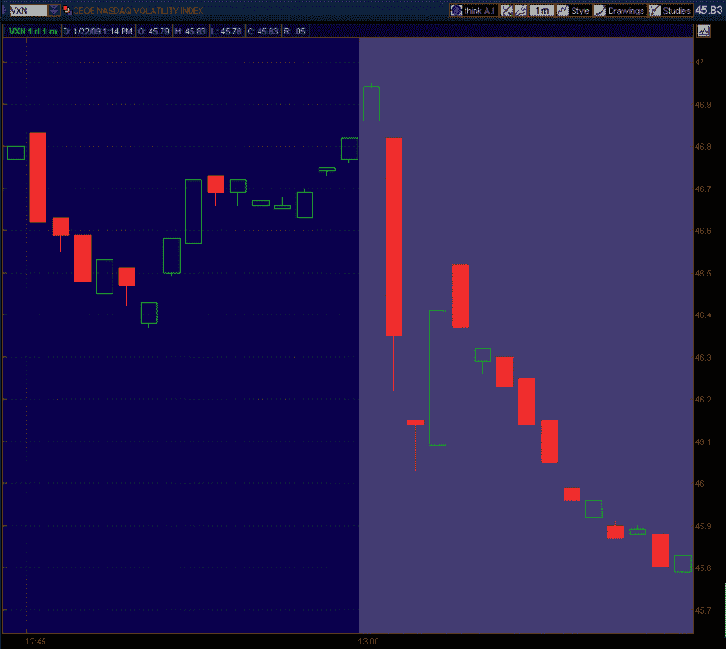

<!--yml
category: 未分类
date: 2024-05-18 18:04:07
-->

# VIX and More: VIX (and VXN) After Hours

> 来源：[http://vixandmore.blogspot.com/2009/01/vix-and-vxn-after-hours.html#0001-01-01](http://vixandmore.blogspot.com/2009/01/vix-and-vxn-after-hours.html#0001-01-01)

I recently received a question about large movements in the VIX at the end of the day.

Before I answer this question, it is important to recall that trading hours for index options are 9:30 a.m. – 4:15 p.m. ET.

As I see it, this question about late day movements in the VIX spans two very different time frames:

*   the last 15 minutes or so of the regular equities trading day (3:45 – 4:00 p.m. ET)
*   the 15 minutes following the close of trading of equities, during which stock index products are still traded (4:00 – 4:15 p.m. ET)

Looking at the earlier period first, during the last 15 minutes of regular trading on the NYSE and NASDAQ, high volume program trading often kicks in and includes or sometimes triggers a large volume of SPX options trades. These situations are relatively easy for retail trader to spot on the tape and are generally consistent with sharp moves in the SPX.

The fifteen minutes of index trading following the close of the equities market are more often associated with unusual large moves in the VIX. Part of the reason for this is the large volume of news that is announced just after the market close. Included in these announcements, of course, are earnings reports, such as today’s eagerly anticipated report from Google ([GOOG](http://vixandmore.blogspot.com/search/label/GOOG)).

In an announcement that crossed the wires at 4:01 p.m. ET, Google beat analyst estimates for both revenues and earnings, sending the stock up over 2% in the 15 minute [twilight zone](http://vixandmore.blogspot.com/search/label/twilight%20zone) while index trading was still open.

Google is the second largest component of the [NDX](http://vixandmore.blogspot.com/search/label/NDX) (NASDAQ-100), so the obvious place to see Google’s impact on the volatility indices is the [VXN](http://vixandmore.blogspot.com/search/label/VXN). The chart below, courtesy of thinkorswim, shows the VXN during the last 16 minutes of today’s regular equities trading session (using my local PT time stamp), as well as during the 4:00 – 4:15 end of the index trading session. The chart shows the positive surprise in Google helped to push VXN down 0.99 (2.1%) in the 15 minutes after the close of trading in the NYSE and NASDAQ regular session. Had Google beaten analyst expectations by a larger amount – or had a significant miss – I would not have been surprised to see the VXN move 5-10% during the twilight zone.

*[source: thinkorswim]*