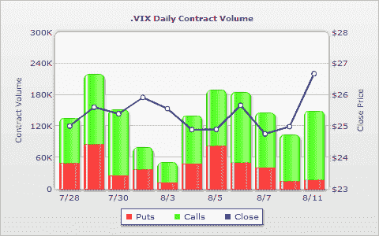

<!--yml
category: 未分类
date: 2024-05-18 17:34:22
-->

# VIX and More: VIX Calls Attract Attention

> 来源：[http://vixandmore.blogspot.com/2009/08/vix-calls-attract-attention.html#0001-01-01](http://vixandmore.blogspot.com/2009/08/vix-calls-attract-attention.html#0001-01-01)

The VIX is up about 7.4% as I type this, to 26.84, as the recent rally is finally beginning to shows signs of running out of steam.

Weakness and stocks and the rise in the VIX has generated some interest in VIX calls, with the September 35s, September 45s and August 37.5 calls attracting most of the action at the ask.

With today’s session not even at the halfway point, VIX call volume is running at a high level and the ratio of VIX calls to puts is considerably higher than the recent trend, as the chart below from WhatsTrading.com reflects. It is difficult to determine whether the [VIX options](http://vixandmore.blogspot.com/search/label/VIX%20options) activity reflects new speculation or new hedging activity, but my best guess is that a good deal of the activity is speculative.

Note that VIX options expire one week from tomorrow (see [expiration calendar](http://www.theocc.com/publications/xcal/xcal2009.pdf)) and have a last trading day of one week from today.

Any close over 26.31 would mark the highest close in the VIX for a month, but it would take a spike all the way to 28.13 to bring the VIX to a level that is 10% over its [10 day moving average](http://vixandmore.blogspot.com/search/label/10%20day%20SMA).

*[source: WhatsTrading.com]*