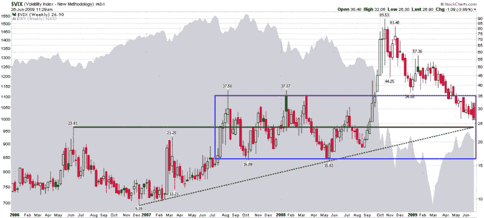

<!--yml
category: 未分类
date: 2024-05-18 17:41:12
-->

# VIX and More: VIX Convergence Zone in Mid-20s

> 来源：[http://vixandmore.blogspot.com/2009/06/vix-convergence-zone-in-mid-20s.html#0001-01-01](http://vixandmore.blogspot.com/2009/06/vix-convergence-zone-in-mid-20s.html#0001-01-01)

Since Fridays are days in which recent VIX lows are often tested, I thought this might be a good time to step back from the typical VIX daily chart and look at a weekly chart. In the chart below, I have elected to go back to the beginning of 2006 to capture the details of what was arguably the lowest volatility year on record so it could be compared with the most volatile year we have witnessed, 2008.

While volatility first began to spike in [February 2007](http://vixandmore.blogspot.com/search/label/February%2027), it was not until July 2007 that investors began to come to terms with the potential magnitude of the damage should the [subprime mortgage](http://vixandmore.blogspot.com/search/label/subprime%20mortgage) crisis morph into a global financial contagion. From July 2007 to September 2008, volatility was elevated, but seemingly contained in the 16-35 range represented by the blue box in the chart. It just so happens that the midpoint of that range roughly coincides with the 2006 VIX high of 23.81 that is represented by the horizontal green line.

To complete the picture, I have added a dotted green trend line that connects the December 2006 low to the May 2008 low. Like the 2006 high and the median for the blue box, it projects to about the 24-25 range.

This is not to say that the VIX cannot go below 24-25, but given the 3.06% drop in the SPX on Monday and the 2.14% gain yesterday, the current 26.65 level in the VIX does seem inconsistent with recent single day volatility.

*[source: StockCharts]*

***Disclosure****: Long VIX at time of writing.*