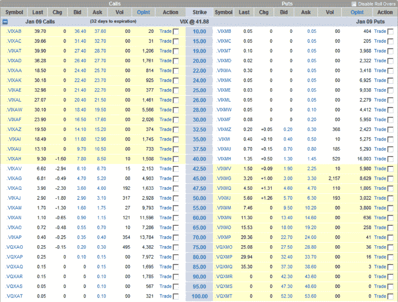

<!--yml
category: 未分类
date: 2024-05-18 18:10:01
-->

# VIX and More: VIX Drops Below 42; VIX Calls in Play

> 来源：[http://vixandmore.blogspot.com/2008/12/vix-drops-below-42-vix-calls-in-play.html#0001-01-01](http://vixandmore.blogspot.com/2008/12/vix-drops-below-42-vix-calls-in-play.html#0001-01-01)

The range-bound action in equities over the last few weeks has brought us something we have not seen since October 3^(rd): a VIX below 42.

With the [VIX futures](http://vixandmore.blogspot.com/search/label/VIX%20futures) for January and February still trading in the 47-48 range, the consensus opinion is that a 42 is not sustainable. In fact, supporting that opinion is the flurry of activity in the January 70 and 75 calls in the past few minutes, as speculators (and perhaps hedgers) jump at the pre-Christmas sale prices on [VIX options](http://vixandmore.blogspot.com/search/label/VIX%20options).

The graphic below summarizes the action in the VIX January options, with almost all of the action in the January 75 calls coming as I type this.

*[source: optionsXpress]*