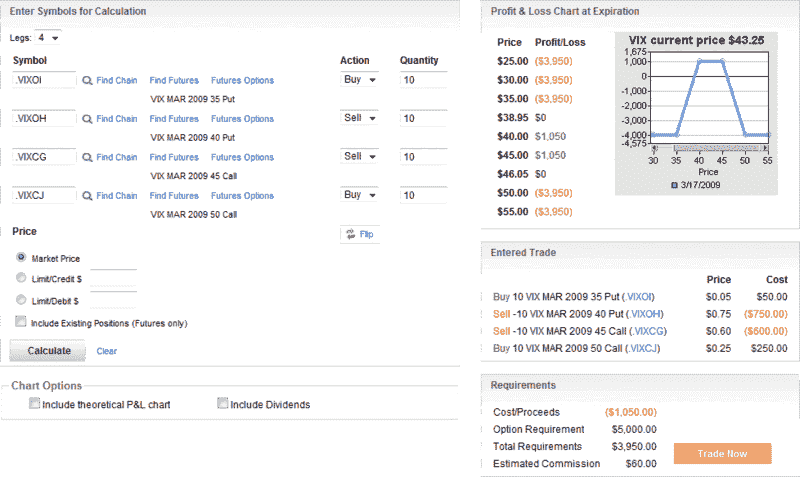

<!--yml
category: 未分类
date: 2024-05-18 17:55:22
-->

# VIX and More: VIX Expiration Condors

> 来源：[http://vixandmore.blogspot.com/2009/03/vix-expiration-condors.html#0001-01-01](http://vixandmore.blogspot.com/2009/03/vix-expiration-condors.html#0001-01-01)

A quick reminder for anyone holding [VIX options](http://vixandmore.blogspot.com/search/label/VIX%20options) or contemplating VIX options trades in the next day or two that the last day of trading for VIX March options is tomorrow. VIX options expire on Wednesday, with [settlement](http://vixandmore.blogspot.com/search/label/VIX%20SOQ) at the open of trading for SPX options on Wednesday morning. For those that have not done so already, I recommend bookmarking the [OCC options expiration calendar](http://www.theocc.com/publications/xcal/xcal2009.pdf), which I have included as a permanent link in the right hand column of the blog.

As VIX [options expiration](http://vixandmore.blogspot.com/search/label/options%20expiration) approaches, I am reminded of one trader who likes to go long iron [condors](http://vixandmore.blogspot.com/search/label/condor), usually on Monday or Tuesday, in a bet that the VIX will be relatively quiet prior to expiration. The iron condor trade is very similar to [A VIX Butterfly Play](http://vixandmore.blogspot.com/2009/02/vix-butterfly-play.html), which I described last month (see also [Follow Up to “A VIX Butterfly Play”](http://vixandmore.blogspot.com/2009/02/follow-up-to-vix-butterfly-play.html)), with one exception that the condors have a wider maximum profit zone, but smaller maximum upside. There are some other practical differences between a butterfly and condor as well, notably that the condors are less likely to require follow-up position adjustments and additional commissions. Perhaps more germane to the trade above, it is sometimes appropriate to let condor trades run to expiration, but this is rarely a desirable approach for butterflies.

The chart below outlines a VIX iron condor trade, with data from optionsXpress this morning. I call these pre-expiration trades “expiration condors.”

For more information on iron condors and a broad range of excellent options-related content, I recommend visiting [Condor Options](http://www.condoroptions.com/).

*[source: optionsXpress]*