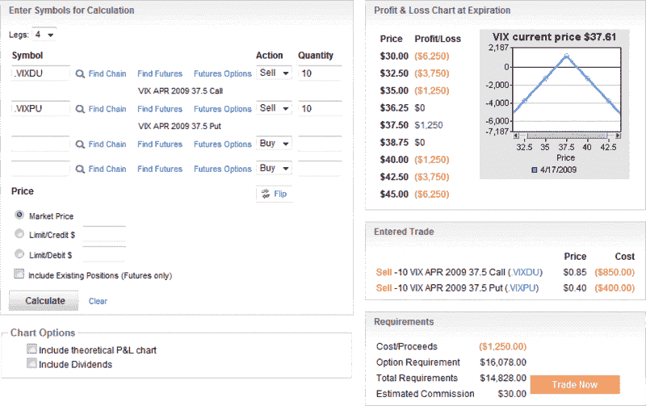

<!--yml
category: 未分类
date: 2024-05-18 17:51:58
-->

# VIX and More: VIX Expiration Straddles

> 来源：[http://vixandmore.blogspot.com/2009/04/vix-expiration-straddles.html#0001-01-01](http://vixandmore.blogspot.com/2009/04/vix-expiration-straddles.html#0001-01-01)

With less than an hour left before today’s trading session comes to a close and the April [VIX options](http://vixandmore.blogspot.com/search/label/VIX%20options) can no longer be traded, this seems like as good a time as any to mention a pure overnight volatility gamble: the VIX expiration [straddle](http://vixandmore.blogspot.com/search/label/straddle).

I have difficulty calling this trade anything other than a speculative gamble and am certainly not recommending it, but there are some who love this type of trade.

As outlined in the optionsXpress graphic below, the VIX is at 37.61 as I type this, just 0.11 above the 37.50 strike. In the example indicated in the graphic, selling 10 April VIX 37.50 calls and 10 April VIX 37.50 puts nets $1250\. If the VIX settles at tomorrow’s opening at 37.50, this is the maximum gain. As the profit and loss table shows, break even is at 36.25 and 38.75\. A loss comparable to the maximum profit of $1250 will be realized at 35.00 and 40.00\. If the VIX settles below 35.00 or above 40.00, then the losses will be even more significant. For long positions, the numbers are reversed.

That is pretty much the trade in a nutshell.

Anyone making this trade should be aware that there are several important economic releases before the open tomorrow, including the March CPI data, March industrial production and capacity utilization, and several others. In addition, there is a fairly large slate of earnings due out after the close today and before the open tomorrow. In short, a lot can happen overnight.

Still…if you think the VIX will settle between 36.25 and 38.75, a VIX short straddle is one way to put that idea into action.

It is also important to keep in mind that most options players who are looking to make this trade will likely be doing so several weeks before expiration and close the position out prior to the last trading day...but there are others like like the overnight approach.

For two related VIX expiration options plays, check out:

*[source: optionsXpress]*