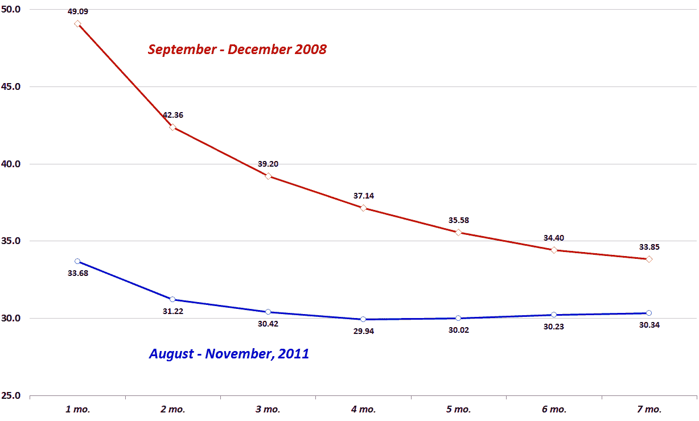

<!--yml
category: 未分类
date: 2024-05-18 16:47:45
-->

# VIX and More: VIX Futures: A Tale of Two Backwardations

> 来源：[http://vixandmore.blogspot.com/2011/11/vix-futures-tale-of-two-backwardations.html#0001-01-01](http://vixandmore.blogspot.com/2011/11/vix-futures-tale-of-two-backwardations.html#0001-01-01)

After yesterday’s [New VIX Backwardation Record](http://vixandmore.blogspot.com/2011/11/new-vix-backwardation-record.html) post, I thought it might be interesting to compare the [VIX futures](http://vixandmore.blogspot.com/search/label/VIX%20futures) [term structure](http://vixandmore.blogspot.com/search/label/term%20structure) during the past three months to that of the prior record, which spanned September to December 2008.

The mechanics for graphing VIX futures over time are fairly complicated, as not only do values change daily, but on any day there can be up to ten futures contracts traded, with the front seven months generally being the only actively traded contracts. Of course, the futures roll every month, so the result is a rolling and scrolling array of data.  My efforts at oversimplifying this problem for the purposes of comparing the record 2011 backwardation data and the prior record data from 2008 resulted in the graphic below, which shows the average front month, second month, etc. values for the VIX futures all the way out to the seventh month.  Note the relatively mild in [backwardation](http://vixandmore.blogspot.com/search/label/backwardation) in 2011 compared to the steep backwardation in 2008\. In fact, the 2011 curve is essentially flat from the third month through the seventh month, while the 2008 curve slopes down throughout the entire term structure.

Clearly some of the differences between the shape of the term structure in 2011 vs. 2008 can be attributed to the absolute level of the VIX and the fact that [mean reversion](http://vixandmore.blogspot.com/search/label/mean%20reversion) expectations were therefore much higher in 2008 than during the past few months.

Students of the VIX may find it interesting that the front two months of the VIX futures briefly reverted to [contango](http://vixandmore.blogspot.com/search/label/contango) in the middle of December of 2008, while both the VIX and the front month VIX futures were still above the 55.00 level.

As it turns out, the VIX futures during late 2008 greatly overestimated the level of the VIX during the first half of 2009\. It will be interesting to see if the same can be said for the first half of 2012.

Related posts:

**

 *[sources: CBOE Futures Exchange, Interactive Brokers]*

***Disclosure(s):*** *short VIX at time of writing*