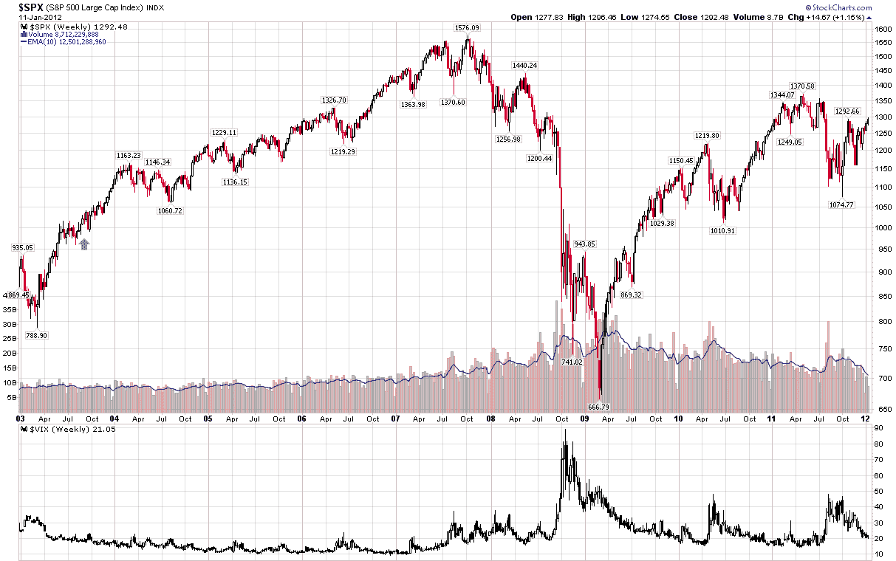

<!--yml
category: 未分类
date: 2024-05-18 16:43:46
-->

# VIX and More: VIX Has Smallest Intraday Range Ever!

> 来源：[http://vixandmore.blogspot.com/2012/01/vix-has-smallest-intraday-range-ever.html#0001-01-01](http://vixandmore.blogspot.com/2012/01/vix-has-smallest-intraday-range-ever.html#0001-01-01)

If ever there was a day to be short the volatility of volatility, it was today. In fact, today established a new record for the smallest (in percentage terms) intraday range for the VIX, a mere 1.14%.

For those who are curious (and I know you are out there), the previous record of 1.24% dates from August 29, 2003.

The chart below includes weekly bars and dates from January 2003.  It puts the prior small range day into context with a green arrow marking the previous record. For those who are more curious about historical precedent, in the month or so following the old record, the VIX slowly drifted up from 18.63 to the 22s, briefly touching over 23 on one day. Then, of course, the influence of the bull market took over and a VIX of 25 was not seen until 2007.

 *******

*[source(s): StockCharts.com, CBOE, Yahoo]*

Disclosure(s):

*none**