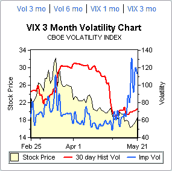

<!--yml
category: 未分类
date: 2024-05-18 18:35:43
-->

# VIX and More: VIX Implied Volatility Surges

> 来源：[http://vixandmore.blogspot.com/2008/05/vix-implied-volatility-surges.html#0001-01-01](http://vixandmore.blogspot.com/2008/05/vix-implied-volatility-surges.html#0001-01-01)

This is where things get fun.  The VIX is a measure of implied volatility of SPX options, yet the VIX also has its own implied volatility, derived from [VIX options](http://vixandmore.blogspot.com/search/label/VIX%20options), which I am simply going to call VIX IV.  Since we are on the verge of a long weekend (for some), just think of the VIX IV as the implied volatility of the implied volatility of the S&P 500 index.  If you prefer, call it [meta volatility](http://vixandmore.blogspot.com/search/label/meta%20volatility).

The reason I bring up these mental gymnastics is that the implied volatility of VIX options has been increasing dramatically over the course of the past two weeks.  Given that there are different methods for calculating an aggregate implied volatility number across a range of strikes, it is not surprising that different sources can arrive at a different aggregate IV value.  In the case of the VIX, the three month implied volatility charts from optionsXpress (above right) and iVolatility.com (below) seem to arrive at very similar numbers, with the VIX IV jumping from about 50 to 115 or so over the past two weeks.  In the case of the ISE (very bottom), their methodology shows VIX IV hitting a new 52 week high of 230 on yesterday and hovering around 198 today.

I am not sure why there is such a large discrepancy between the ISE and the other two sources – and I will be back to clarify this when I get a good explanation – but the key takeaway is that while implied volatility in the SPX is starting to edge back up slowly, volatility in the VIX is surging.  There are several possible explanations for this phenomenon, but in all cases, the surge in VIX IV suggests that options traders are pricing in much higher uncertainty associated with near-term VIX values.  One possible translation:  traders believe that the probability of a significant spike in the VIX is increasing.