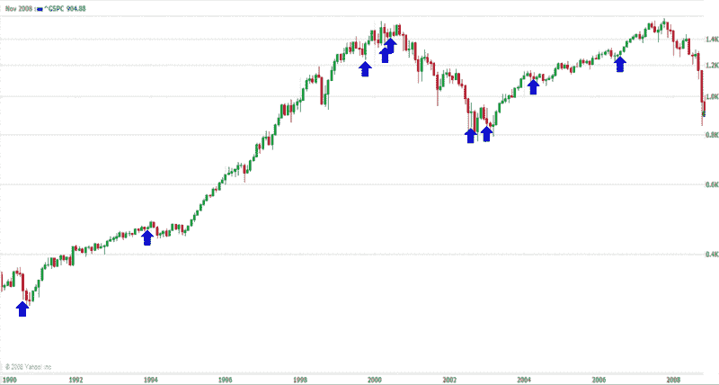

<!--yml
category: 未分类
date: 2024-05-18 18:17:13
-->

# VIX and More: VIX Jumps 10% on Consecutive Days

> 来源：[http://vixandmore.blogspot.com/2008/11/vix-jumps-10-on-consecutive-days.html#0001-01-01](http://vixandmore.blogspot.com/2008/11/vix-jumps-10-on-consecutive-days.html#0001-01-01)

In most of the world, yesterday’s big news was that the S&P 500 index fell 5% for the second day in a row. Here at VIX Central, I was also interested to note that the VIX jumped 10% for the second day in a row, something that has happened on nine previous occasions going back to 1990.

From a market timing perspective, the history of consecutive double digit jumps in the VIX does show a significant bullish bias going forward, but not one that develops until after the first day. In the graphic below, courtesy of Yahoo, I have also put these nine double jumps into historical perspective by marking them with blue arrows. These double jump days do tend to appear at important inflection points, but these are not necessarily at reversals, nor are they necessarily associated with bull markets. On balance, however, I would consider this double jump VIX activity to be a bullish development.

[source: Yahoo]