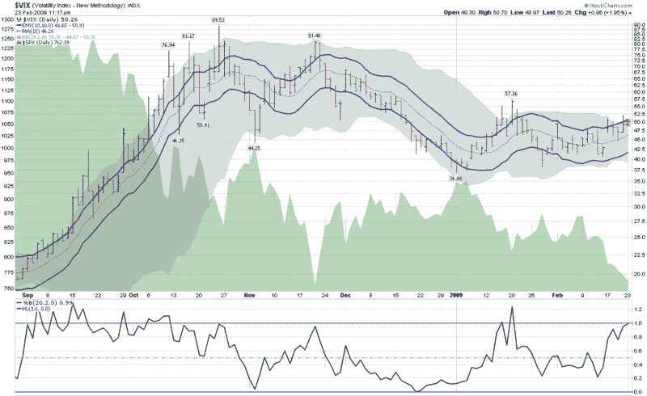

<!--yml
category: 未分类
date: 2024-05-18 17:58:23
-->

# VIX and More: VIX Kitchen Sink Chart

> 来源：[http://vixandmore.blogspot.com/2009/02/vix-kitchen-sink-chart.html#0001-01-01](http://vixandmore.blogspot.com/2009/02/vix-kitchen-sink-chart.html#0001-01-01)

The VIX is once again above 50 as I type this and technical analysis aficionados are wondering where the next resistance levels are for the VIX and whether these might increase the odds of predicting a market bottom.

The chart below is a kitchen sink chart of sorts, as it includes the 10 day moving average of the VIX (dotted blue line), surrounded by 10% [moving average envelopes](http://vixandmore.blogspot.com/search/label/moving%20average%20envelopes) (solid blue lines) to indicate when the VIX is 10% above or below that 10 day moving average.

The chart also includes [Bollinger Bands](http://vixandmore.blogspot.com/search/label/Bollinger%20bands) (the gray cloud around the price history), which have been left at the default 20 day, 2.0 standard deviations settings. I have also added the [%b](http://vixandmore.blogspot.com/search/label/%25b) setting for the Bollinger Bands in order to determine where the VIX is relative to the middle (0.5) of the Bollinger Band range.

During highly volatile periods, the Bollinger Bands are typically much wider than the moving average envelopes and large moves in the VIX usually pierce the moving average envelopes before they reach the limits of the Bollinger Bands. At present, however, the upper boundary of the Bollinger Bands is at 50.36, with the top of the moving average envelope at 50.91\. With the VIX having posted an intraday high of 50.70 so far, the Bollinger Bands have been violated, yet the moving average envelope is intact. This unusual situation reflects the relatively low [historical volatility](http://vixandmore.blogspot.com/search/label/historical%20volatility) we have been experiencing (the 20 day historical volatility in the SPX is below 35 and 50 day historical volatility in the SPX is the lowest it has been since September.)

If one considers that [implied volatility](http://vixandmore.blogspot.com/search/label/implied%20volatility) is largely a function of historical volatility plus a premium based on [fear](http://vixandmore.blogspot.com/search/label/fear) and uncertainty, then obviously the fear and uncertainty component is currently responsible for implied volatility (in the form of the VIX) being almost 50% higher than historical volatility.

*[source: StockCharts.com]*