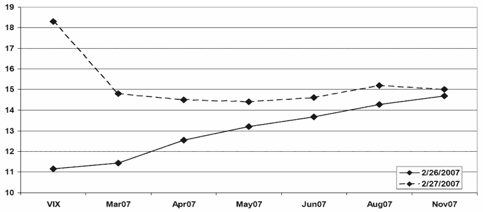

<!--yml
category: 未分类
date: 2024-05-18 18:36:23
-->

# VIX and More: VIX Options in Current Declining Volatility Environment

> 来源：[http://vixandmore.blogspot.com/2008/05/vix-options-in-current-declining.html#0001-01-01](http://vixandmore.blogspot.com/2008/05/vix-options-in-current-declining.html#0001-01-01)

Kudos to Adam at Daily Options Report for today’s [A Quick Trading VIX Primer](http://adamsoptions.blogspot.com/2008/05/quick-trading-vix-primer.html), which provides a succinct explanation of the basis for [VIX options](http://vixandmore.blogspot.com/search/label/VIX%20options) prices – some of which have left casual options traders scratching their heads in recent days.

In Adam’s words:

*“The VIX estimates volatility on the SPX itself for the next 30 days.*

 **VIX futures are a bet on where that estimate will be on the day the future expires. In other words, it is a snapshot of what the market expects for volatility 30 days AFTER the future expires. If it is a September future for example, you are guessing how the market prices volatility 30 days forward from September expiration. You are not betting on SPX volatility between now and September; that is a common misconception.”*

Two graphics might help to illustrate this point.  The first graphic initially appeared on *VIX and More* one year ago in [VIX Futures: The One Picture to Remember](http://vixandmore.blogspot.com/2007/05/vix-futures-one-picture-to-remember.html) and shows what happened to the [VIX futures](http://vixandmore.blogspot.com/search/label/VIX%20futures) on the day before and the day of the record 64% spike on the VIX on [February 27^(th) 2007](http://vixandmore.blogspot.com/search/label/February%2027).  The bottom line is that the long-term outlook for volatility did not change appreciably, but the VIX futures moved from [contango](http://en.wikipedia.org/wiki/Contango) (upward sloping over time) to [backwardation](http://en.wikipedia.org/wiki/Backwardation) (downward sloping over time).  So the future still looked the same, but the VIX was expected to take a different path to arrive at essentially the same place.

The second graphic is a snapshot of the VIX options as of this morning.  Note that with the (cash/spot) VIX at 17.24, the bid on the May 17.00 puts (0.15) is almost the same as the bid on the May 22.50 calls (0.10).  The reason?  [Mean reversion](http://vixandmore.blogspot.com/search/label/mean%20reversion) is priced into the VIX futures – and the options reflect the consensus opinion that a 5 point VIX spike is just about as likely as a 0.25 point drop in the VIX over the next week (recall that [VIX options expire on Wednesdays](http://www.theocc.com/publications/xcal/xcal2008.pdf); this month it is one week from today.)*